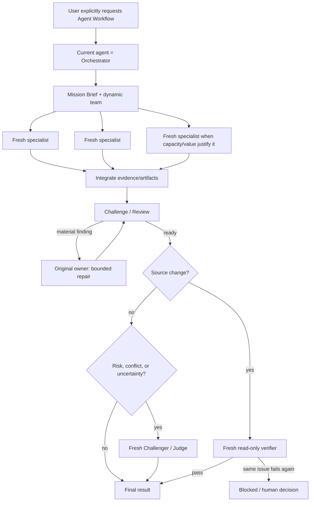

# Agent Workflow — Native Thin Team Specification

狀態：Architecture explanation；唯一 canonical source contract 是
`skills/agent-workflow/SKILL.md`
日期：2026-07-15
適用範圍：`skills/agent-workflow/`

## 1. Outcome

使用者明確要求 Agent Workflow、agent team、parallel agents、swarm、adversarial review
或 fresh-context verification 後，目前的 agent 成為 Orchestrator，直接使用 host 原生
collaboration tools 組成真正的 agent team。

目標有兩個：

1. 把真正獨立的工作同時執行，降低 elapsed time；
2. 用獨立思考、對抗性 falsification、review、bounded repair 與 fresh verifier 提高品質。

這個 1.0 contract 不建立第二套 agent runtime，不以外部 CLI 啟動 agents，不要求使用者手動指定 team
或 review 對話，也不讓 workflow ceremony 比任務本身更大。

## 2. Architecture



The current agent remains the single Orchestrator. It does not spawn another
Orchestrator by default. Specialists start with `fork_turns="none"`, which gives
fresh judgment without consuming a team slot for an extra coordination layer.

## 3. Native-only lifecycle

Allowed agent lifecycle primitives are the host's native equivalents of:

- `spawn_agent`
- `send_message`
- `followup_task`
- `wait_agent`
- `interrupt_agent`

Forbidden for agent lifecycle:

- external model CLIs;
- external workflow runners;
- generated process supervisors, polling scripts, App Server clients, or shell
  background jobs used to launch, resume, join, or monitor agents.

Task-specific tests, builds, linters, data scripts, and deterministic validation
remain valid. The boundary is agent lifecycle, not ordinary engineering tools.

When native collaboration is absent, the result is `unsupported_environment`.
There is no manual-simulation or silent single-agent fallback.

## 4. Mission Brief

Before dispatch the Orchestrator defines:

- outcome;
- user-visible and deterministic proof;
- constraints and confirmed decisions;
- relevant context and roots;
- write/decision ownership;
- authority and actions requiring later approval.

The brief is compact and self-contained. Main transcript, unrelated history,
raw logs, and other agents' reasoning are not inherited by specialists.

## 5. Smart decomposition

An agent is justified only by at least one of these values:

- an independent question can be answered concurrently;
- a separately owned artifact can be created safely;
- an orthogonal review lens can detect different failures;
- fresh context is needed to resist anchoring;
- a material claim needs adversarial falsification.

Each task declares `unique_question`, `owned_outcome`, `inputs`, `ownership`,
`proof`, `terminal_deliverable`, and `stop_condition` in natural language. These
are model planning concepts, not a runtime schema or persisted state machine.

The Orchestrator does not create duplicate agents merely to obtain votes.

## 6. Parallelism and write ownership

All ready tasks sharing the same upstream state launch in the same wave.
Research, inspection, alternatives, test design, source reading, and independent
review may run in parallel.

Writers may run in parallel only when ownership is visibly disjoint:

- no shared files;
- no ancestor/descendant path overlap;
- no shared semantic interface being changed concurrently;
- no dependency on another writer's unfinished result.

When any condition is uncertain, use one writer and parallel read-only support.
The Orchestrator checks the resulting diff and integrates the team outputs.

## 7. Context and agent packets

Every specialist starts fresh and receives only:

1. owned outcome and why it is separate;
2. required inputs, facts, paths, and constraints;
3. read/write ownership and forbidden overlap;
4. acceptance checks and proof expectations;
5. compact terminal deliverable;
6. stop conditions and blockers;
7. no recursive delegation unless explicitly appointed to an independent subtree.

Agents return conclusions, evidence, changed paths, checks, uncertainties, and
recommended next action—not progress narration or full transcripts.

## 8. Evidence-based collaboration

Independent work happens before cross-agent influence. A challenge uses:

```text
CLAIM
EVIDENCE
RISK
REQUEST
```

A Challenger attacks assumptions with concrete counterexamples, source evidence,
tests, or failure modes. The original owner gets one bounded response per finding:
fix it, or rebut it with new evidence. Agreement, confidence, and majority vote do
not close a finding.

Direct messages are reserved for dependency clarification and material findings.
The Orchestrator owns integration and final decisions; agents do not form an
unbounded peer-chat loop.

## 9. Fresh verification

Self-check is evidence, not approval. A source-changing workflow must finish with
a new read-only Verifier that:

- starts with `fork_turns="none"`;
- did not author the change;
- receives objective, criteria, final artifact/diff, relevant source, and proof;
- does not receive builder confidence, transcript, or desired verdict;
- checks correctness, regression risk, deterministic tests, scope, and unresolved
  material findings.

The Orchestrator fingerprints the relevant artifact and source diff immediately
before verifier dispatch and compares it after the terminal result. Any mutation
by the verifier invalidates the verdict; the changed scope returns to the original
owner instead of being approved in place.

Research and decision workflows add an independent challenger or judge when
sources conflict, stakes are high, or assumptions dominate the recommendation.

Verification failure creates one targeted repair for the falsified scope and then
a fresh re-verification. Repeated failure of the same issue becomes blocked or a
human gate; renaming agents or tasks cannot reset it.

## 10. Coordination density

The Orchestrator wakes for semantic information, not activity:

- a terminal specialist result;
- a material dependency or evidence conflict;
- repair required;
- user steering or authority change;
- final verification.

It does not poll, redraw status cards, emit "still running" messages, read partial
worker logs, or use conversation as a progress bus. Completed siblings are kept;
only invalidated or unsafe work is interrupted.

## 11. Model routing

Semantic role and independent identity are normative. Per-agent model selection
is not. The current native spawn surface does not guarantee model/reasoning
overrides, so the contract does not shell out to manufacture Sol/Terra routing.

If the host later exposes model-aware native spawn, routing may be added as an
optional optimization. Missing routing must never disable native teamwork or
change proof requirements.

## 12. Authority

Normal read, scoped working-tree changes, tests, repair, and verification follow
the user's task authority. These remain separate approval boundaries unless the
exact action was already authorized:

- commit;
- push or PR;
- publish or external messages;
- deploy, release, local production, or production mutation.

The workflow does not invent another permission matrix.

## 13. Completion

Agent Workflow is complete only when:

- the requested outcome exists;
- relevant proof passes;
- fresh independent verification passes where required;
- all native agents are terminal;
- material findings are fixed, evidence-rebutted, or explicitly unresolved;
- remaining risks and pending external actions are visible.

The final report is compact: outcome, team/parallel work, proof, material
challenge and repair decisions, changed artifacts, and remaining risks.

## 14. Acceptance criteria

- Explicit invocation spawns a real native team.
- Every child uses a fresh, self-contained packet.
- Ready independent tasks launch without serial waiting.
- Parallel writers have disjoint ownership; uncertain overlap yields one writer.
- At least one evidence-based challenge/review lens is used when material risk
  exists.
- Source changes receive fresh read-only verification.
- Same finding cannot produce an unbounded repair loop.
- Agent lifecycle makes zero external CLI/runtime calls.
- Progress-only polling and narration are zero.
- External actions respect approval boundaries.
- Blind real-task evaluation shows correctness non-inferiority and a material
  quality or elapsed-time gain before release promotion.
