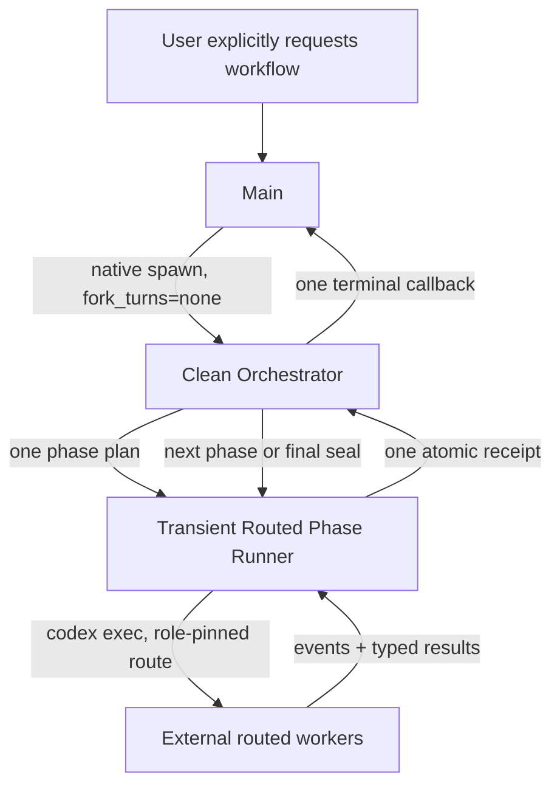

# Agent Workflow vNext — Thin Skill, Routed Phase Runner

狀態：Final design；three-angle independent review approved（99/98/98 confidence）
日期：2026-07-12
適用範圍：Codex Desktop on macOS、`skills/agent-workflow/`

## 1. Problem

現行 Agent Workflow 的主要成本不是 worker 本身，而是高 context coordinator 被大量
tool result、lifecycle event、status check 與 wait continuation 反覆喚醒。只壓縮 worker
起始 packet，或在 prompt 中要求「不要 polling」，都無法消除這個乘法：

```text
coordinator context size × coordinator completion count
```

現行 harness 也把 rounds、lanes、mutable state、runner evidence、rendering、accounting 與
compatibility policy交織在一起。它能檢查很多欄位，卻無法保證最重要的 runtime 行為：

- Main 不管理 workers；
- worker model 確實依角色 routing；
- 一批平行工作只在 terminal boundary 喚醒 Orchestrator；
- writer 不越界、不 blind retry；
- crash、timeout 與 dirty worktree 都會有界終止；
- final claim 有獨立驗證與可追溯 evidence。

vNext 將其重構為一個 thin skill、一個短命且 deterministic 的 Phase Runner，以及一組最小的
immutable artifacts。不建立長駐 runtime service，也不以更多 configuration 補洞。

## 2. Outcome

使用者明確要求 Agent Workflow 後：

1. Main native-spawn 一個 `fork_turns=none` Clean Orchestrator，只交付 bounded Workflow Brief。
2. Orchestrator 一次規劃 high-level phase skeleton，之後逐 phase materialize task plan。
3. 每個 phase 只呼叫一次 `run_phase(plan) -> receipt`；runner 以外部 `codex exec` roots
   執行 mandatory model routing、等待 all-terminal、驗證 output，最後只回一份 compact receipt。
4. Orchestrator 只在 phase terminal、human gate、blocked 與 final 等 semantic boundary 醒來。
5. source-writing workflow 必須經過 clean-context、read-only、top-model Verification Phase。
6. Orchestrator atomic seal `final.json`；Main 只把 compact final payload 轉成對使用者的回覆。

Correctness 與 performance 優先於 token budget。vNext 要移除沒有新資訊的 completion，而不是
減少必要研究、實作或獨立驗證。

## 3. Non-goals

- 不建立 daemon、長駐 queue、獨立 workflow service 或第二套 thread registry。
- 不把 external routed workers 假裝成 Codex native Subagents tree。
- 不支援 Claude Code、Windows 或跨 host abstraction；v1 只承諾 Codex Desktop/macOS。
- 不提供 legacy Main-led fan-out、wrapper polling、manual simulation 或 same-model fallback。
- 不固定研究／實作／驗證的 phase 數，也不以兩個 worker 作 token-driven scale cap。
- 不讓 runner 判斷產品語意、claim correctness 或 repair priority。
- 不把 `view.json`、Swarm Card 或 self-reported token 數當 authoritative truth。
- 不把 commit、publish、deploy 或 production mutation納入自主權限。

## 4. Design principles

### 4.1 Thin skill, one small lifecycle executable

`SKILL.md` 只定義啟動條件、角色、first principles、semantic boundaries 與 authority rule。
所有 deterministic control集中在一個短命 executable。重複執行的 worker-lifecycle seam只有一個：

```text
run_phase(plan_ref) -> receipt_ref + compact terminal summary
```

同一 executable另提供四個小型 lifecycle transactions：`admit`、`cancel`、`reconcile`、`seal-final`。
它們只做 create-once artifacts、fencing、authority cancellation與 terminal reconciliation，不做語意規劃。
第一個 phase可用 `run-once(workflow_ref, plan_ref)`把 admission、blocking `run_phase`、cleanup與
terminal summary合成單一 CLI transaction；這只是避免 Orchestrator為 deterministic plumbing重新
completion，不新增語意 policy，也不取代後續 phase的 `run_phase` seam。
Executable可以有 cohesive內部 modules，但不得演化成 lane-specific scripts、mutable workflow controller
或需要常駐服務的 framework。

Pre-cutover candidate入口維持 high-freedom、first-principles instruction：只保留 explicit invocation、one clean
Orchestrator、dynamic Phase、mandatory `top`/`worker` routing、typed receipt、terminal-boundary wake、exact-lineage
recovery、independent top verification與 human-gated external actions。CLI參數、artifact contract與 transaction
mechanics只放在一個 on-demand runtime reference；candidate不得複製 runtime手冊。

### 4.2 Model owns semantics; code owns protocol

Orchestrator 負責規劃、reduce、衝突判斷、repair strategy、human gate 與 final decision。
Runner 只負責 schema、routing、process、deadline、path isolation、terminal events、digests 與
atomic artifacts。若一條規則不能由 runner 驗證、不能支援 resume、也不影響 safety，就不進 schema。

### 4.3 Context is capability-scoped

Main transcript 不進 Orchestrator；Orchestrator transcript 不進 workers。Orchestrator 不直接探索
repo、web、large documents 或 raw logs，而是提出需要回答的問題，materialize routed task，消費
compact typed receipt。

v1能機械保證的是 clean input packet與 transcript exclusion；目前 native child tool surface不能被 portable
skill縮成只剩 control-plane tools。因此「Orchestrator不做 raw exploration」是 prompt + raw-session audit
的 fail-final invariant，不宣稱為 launch-time filesystem security boundary。每個 canary都要驗證 Orchestrator
只有 lifecycle executable calls與 bounded control-plane reads；一旦出現 repo/web/raw-log exploration，該 run
不得作 efficiency或 production-quality pass claim。未來 host若提供 child tool/read-root profile，再升級為
admission-enforced boundary。

### 4.4 Semantic completion density

Coordinator completion 應隨 semantic decisions 成長，不隨 worker 數、shell commands、artifact
files 或等待時間成長。正常 phase 的 coordinator wake 預算是：dispatch 一次、terminal receipt
一次；host 若能把 blocking call 保持在同一 inference，則只保留 terminal continuation。

### 4.5 Fail closed, no legacy fallback

Model routing、write isolation、deadline supervision、atomic artifacts、independent verification 或
blocking wait transport缺失時，workflow admission失敗。不能靜默退回舊 workflow。

## 5. Domain model

### Task

一個 bounded worker job。Task 有一個 role、packet、inputs、work mode、具體 deadline，必要時有互斥
`write_roots`。所有 Tasks共用一個固定 task-result envelope，不讓 plan選 output schema。

### Phase

一次 `run_phase` operation：一批共享 upstream state、可以在同一 barrier 收斂的 Tasks。Phase
terminal後 immutable，不得追加 task 或改寫 result。

### Cycle

只是一個由 causal graph投影出的 logical iteration，不寫進 authoritative phase schema，也不是資料夾、
registry或另一個 state machine。Workflow只 seal一個 `max_additional_phases`，不另建 cycle或 semantic counters。

### Lineage

Initial task在 seal時取得 create-once `lineage_id`。Criterion ID/revision與 canonical scope digest是該 lineage
的 continuity checks，不是每次重算 identity；recovery即使縮小／分割 roots仍引用原 lineage。換 task、phase
或 scope不能重置 retry budget。只有使用者明確 amendment criterion revision後才能建立新 lineage，且必須
引用舊 blocked outcome。同一 criterion revision已有 failed lineage後，不得以新 lineage ID或新 scope建立
等價後續工作；必須使用該 original lineage的一次 recovery claim，或由使用者 amendment推進 criterion revision。

## 6. Architecture



| Component | Owns | Must not own |
|---|---|---|
| Main | objective、authority、final delivery | worker lifecycle、polling、integration、retest |
| Clean Orchestrator | dynamic plan、semantic reduce、repair、final seal | raw exploration、progress monitoring、high-frequency tools |
| Phase Runner | routing、spawn、queue、wait、deadline、isolation、artifact protocol | product semantics、quality approval、open-ended retry |
| Worker | bounded research/write/verification task | orchestration、peer chat、workflow pass |
| `.workflow` | immutable control/evidence artifacts、rebuildable view | full transcripts、mutable authoritative state |

## 7. Admission contract

Admission occurs once before first phase。它必須 seal：

- objective、success criteria、authority、relevant roots；
- repository HEAD/branch、staged/unstaged/untracked manifest、relevant file digests與 dirty path set；
- routing profile：`top` role、`worker` role、one common reasoning setting；
- host capacity and maximum admitted parallel processes；
- workflow hard deadline and one `max_additional_phases` ceiling；
- blocking wait capability evidence；
- writer sandbox/isolation與 external-effect containment capability；
- cancel-to-active-process-group capability；
- Orchestrator raw-session audit capability與 active generation fence；
- runtime bundle/version digest，供 rollback後 resume；
- accounting coverage declaration。

Built-in defaults come from a versioned qualified routing policy：current qualified top model、routed worker model、
and current session reasoning setting。Overrides只能選同等或更高的 qualified role floor；dequalified、stale、
downward model或 reasoning override直接 admission fail。A phase只引用 `top`或`worker`，不能 silent route drift。
Native Orchestrator本身不可由 current spawn schema override route；只有其 inherited actual route可被 attested為
qualified `top`時才 admission。

Required capabilities:

1. native clean Orchestrator spawn；
2. external route selection plus terminal actual-route evidence；
3. per-task transient watchdog、owned process-group supervision、cancel與 reap；
4. create-once durable artifact writes and immutable validation；
5. Codex permission-profile based read/write/network containment and isolated source-writing workspace；
6. clean read-only top verifier；
7. one blocking runner call or a probed sparse-wait bound；
8. no worker access to publish/deploy credentials、production roots或 mutable `.git`。

Missing core capability produces typed `admission_blocked`。Read-only phases可在 writer capability尚未通過時
canary；任何 source-writing phase必須重新做 phase-local writer admission。Optional UI、native accounting
enrichment或 callback transport只可標 unavailable，不影響 protocol truth。

Fresh ordinary runs不得依賴 promotion workspace、canary archive或開發期 callback receipt才能 admission。
Portable runtime必須提供 source-owned `probe-host-capabilities` materializer：在新 workflow root 中，以一個
terminal barrier平行執行 pinned Terra／Sol read-only probes，逐一 seal raw session、actual route、effective
permission profile、terminal token usage、read-only denial與 focused lifecycle tests，再輸出可直接綁入
`workflow.json`的 capability refs。`source_write`另組合 live `probe-source-write` 的
`sandbox_isolation` binding。兩者皆綁 running bundle、Codex binary/version、relevant root與24小時 freshness。
Host probe的`relevant_root`必須是該workflow create-once snapshot checkout；admission重播同一snapshot manifest
並要求其canonical repository state仍等於live source。不得把isolated snapshot path與live checkout path直接比較，
也不得為了通過admission改成讓worker讀live checkout。Host receipt必須另外綁snapshot manifest ref+digest；
initial admission不得在checkout與manifest缺失時重建替代authority。完成initial admission後，後續phase仍重播同一
immutable manifest與checkout bytes，但不得把合法integration造成的live source變化誤判為host-probe drift。

Main→Clean Orchestrator lineage與最後只回 Main 一次，仍是 host-owned outer boundary；portable process無法
不可偽造地判定「目前是哪一個 native child」，因此不得用可覆寫的環境變數、另一個 Main/child callback或
promotion archive在 admission自我認證。Capability names中的 `blocking_wait`與`raw_session_audit`只表示
Phase runner的 OS all-terminal barrier及 routed worker canonical raw-session replay；outer lineage、`fork_turns=none`
與 final callback另由 host在 completion後審核。缺少 outer audit時 workflow可執行 portable isolated phases，
但最終不得宣稱 target Agent Workflow成功或通過 benchmark/promotion。

Capability profiles：

| Profile | Required facts | Claim allowed |
|---|---|---|
| `capability_probe` | disposable root、outer deadline | feasibility only |
| `read_only_canary` | route/effective read-only policy、minimum watchdog/cancel/reap、transport receipt | non-production canary |
| `source_write` | all admission capabilities、isolated workspace、integration、verification | production-quality candidate |

Relaxed profile不得 silent upgrade claim。Permission capability receipt綁 CLI/host version、effective profile digest、
observed denial probes、initialized tool/MCP inventory與 sanitized environment allowlist，不能只記 requested flags。
每個 capability proof另須列出 raw `evidence_ref`與 digest、producer／validator runtime版本、Codex binary／CLI
版本、觀測時間與 source run/session identity；admission必須實際讀取、驗 digest並驗最小語意，不接受 boolean
或文字 self-assertion。Containment provenance必須重用 live admission相同的 exact permission allowlist，並要求
distinct qualified top/worker contexts與其 source session IDs；source workflow、source Codex identity與 source run
timestamp也必須一致。Probe freshness超過24小時或來源 artifact缺失時 fail closed。
Generic `workspace-write`不符合 writer admission；它可能包含 host temp roots。Writer必須使用 named
`[permissions]` profile，以 `:minimal`加明確 source read roots為底，只對 isolated task roots授予 write；
不得繼承會授予 `:root = read`的 built-in `:read-only`。必須以實際 credential、`.git`、external path與
network denial probe證明 effective policy。Model輸出的 capability JSON不是 evidence。
Host capability receipt必須綁每個 routed role的 supervisor request/terminal、exact command與 sanitized
environment、canonical rollout bytes、persisted turn context與 terminal token usage；caller填入的
`partial_wakes=0`或 copied context本身不是證據。
Exact command必須逐 argv element等於 source-owned probe template，並將 supervisor stdout逐 byte綁到
copied events、由 canonical rollout重新投影 turn context；額外、重複或錯位 flags一律拒絕。Codex host若在
effective profile加入 runtime executable read，只允許由 sealed Codex binary路徑唯一推導且存在的
`codex-resources/zsh/bin/zsh`，不得泛化成 shell／runtime目錄讀取。Request-only crash可消耗唯一 recovery slot；
receipt前已發布的 derived artifacts只允許 exact-byte replay，任何 drift fail closed。

## 8. Workflow Brief and context contract

Main provides only:

- objective and user-visible success criteria；
- confirmed constraints and decisions；
- authority boundary；
- relevant repository/artifact roots；
- known evidence references；
- explicit exclusions and requested deliverable。

It must not include the Main transcript、unbounded logs、full repo dumps、worker transcripts 或 historical
workflow ledger。Orchestrator按 contract只讀寫 Workflow Brief、phase plan、compact receipts、amendments、
final candidate。若缺少資訊，建立 research/synthesis task；不得自行展開 raw investigation。Final audit從
raw session events驗證這條行為，但不把 raw transcript送回 Orchestrator。

`fork_turns=none`只保證不繼承 Main conversation；它不保證 host global developer prompt、tool catalog、skill
catalog或 environment envelope消失。Candidate admission必須用 raw `turn_context`、token event與
`codex debug prompt-input`量出 `host_prompt_floor`，分開報告 cached/uncached input。當前 host若不能關閉這個
floor，workflow仍可做 correctness canary，但不得宣稱「clean packet = tiny total context」。Planner不設硬性
agent cap；它要讓每個 task有足夠 semantic work攤銷 prompt floor，並由 frozen workload實測 quality、latency
與 total tokens後再決定 phase width。

External initial worker還必須由runtime注入固定、model-visible的isolated-worker developer contract：worker只把
sealed Task packet視為任務；除非packet把某個skill file明列為required input／acceptance criterion，這條contract
明確優先於host稍後注入的skill-catalog trigger rule。Worker不啟用其他skills、不delegate、不poll、不探索無關檔案，也不執行未要求的lifecycle
action；只有acceptance criteria需要時才使用tools。這不是宣稱移除host prompt floor，而是阻止固定skill/tool
catalog把bounded Task重新膨脹成Main-like探索。

## 9. Phase plan contract

Normative shape（欄位只保留 protocol 必要資訊）：

```json
{
  "schema_version": "agent-workflow.phase-plan.v1",
  "phase_id": "002-implement",
  "generation_id": "generation-001",
  "predecessor_sha256": "sha256:bbbbbbbbbbbbbbbbbbbbbbbbbbbbbbbbbbbbbbbbbbbbbbbbbbbbbbbbbbbbbbbb",
  "authority_revision": 1,
  "caused_by": ["001-research"],
  "intent": {
    "reason": "Implement the independently verified seams",
    "expected_state_change": "criteria A-C become testable"
  },
  "phase_budget_seconds": 900,
  "tasks": [
    {
      "task_id": "api-writer",
      "lineage_id": "lineage-api-contract",
      "criterion_id": "AC-api-contract",
      "criterion_revision": 1,
      "role": "worker",
      "work_mode": "write",
      "packet_path": "phases/002-implement/tasks/api-writer/packet.md",
      "packet_sha256": "sha256:aaaaaaaaaaaaaaaaaaaaaaaaaaaaaaaaaaaaaaaaaaaaaaaaaaaaaaaaaaaaaaaa",
      "input_refs": ["phases/001-research/receipt.json"],
      "input_sha256": {"phases/001-research/receipt.json": "sha256:bbbbbbbbbbbbbbbbbbbbbbbbbbbbbbbbbbbbbbbbbbbbbbbbbbbbbbbbbbbbbbbb"},
      "write_roots": ["src/api"],
      "execution_deadline_seconds": 600
    }
  ]
}
```

Field budget：

| Field | Deterministic consumer | Authority |
|---|---|---|
| `phase_id`、`generation_id`、`predecessor_sha256`、`authority_revision`、`caused_by` | causal/fencing validation | protocol |
| `intent` | sole opaque digest-bound audit metadata；runner禁止依內容 branching | semantic metadata |
| `phase_budget_seconds` | seal時轉換為 process-local monotonic deadline | protocol |
| task identity/criterion/role/mode/digest-bound packet and input refs/roots/deadline | routing、lineage、sandbox、supervision | protocol |

`collect_all`是 runner固定 default；只有 enumerated safety conditions由 runner改成 fail-fast，plan無此 switch。
Task-result schema固定，Cycle由 projection推導，phase kind只存在於 optional view。這是完整 field budget；
新增 field必須指出 deterministic consumer、verification need或 resume need。

Initial Phase的`predecessor_sha256`等於 workflow baseline digest。Additional Phase的值固定為
`caused_by`最後一個（immediately prior）terminal receipt的 exact digest；其餘 named causes也必須已有合法
terminal receipt。Final replay維持相同線性 authoritative seal並另驗所有 causes只指向 earlier phases；
phase/task重新命名不能改寫 predecessor authority。

Wall-clock `sealed_at`只作 audit。Runner在 process start由 sealed duration budget建立 monotonic deadlines；restart
不沿用失效 monotonic數值，而是以 durable elapsed/remaining budget與 hard wall-clock ceiling reconciliation，
絕不因 clock rollback延長原 budget。

## 10. Runner contract

`run_phase` 必須以一個 terminal-only stdout contract完成：

1. validate workflow seal、phase plan、input digests、lineage/expansion budget；
2. claim active generation/phase fence；write phase在此刻以 sealed baseline重新做 dirty overlap admission；
3. canonicalize paths，拒絕 same、ancestor/descendant、symlink/realpath、case/Unicode、device/inode/hardlink overlap；
   non-existing roots先由 runner建立再 seal；
4. 為每個 task建立 isolated `CODEX_HOME`、sealed named permission profile與 sanitized environment；禁止繼承
   user `CODEX_HOME`／user config，使用 `--ignore-rules`、停用 plugins/MCP、network-off default、`.git`
   read-only、只開必要 read/write roots。若 `--ignore-user-config`會抑制 sealed profile，則不得使用；launch後
   必須由 persisted `turn_context` fail-closed驗證 exact effective profile；
   web task只讀 sealed packet root並使用 allowlisted network，不同時讀 repo；
5. queue tasks into capacity-bounded waves，不增加 Orchestrator wake；
6. 依 role expansion得到 pinned model/effort，以 persisted `codex exec --json --output-schema`啟動；禁用
   `--ephemeral`；
7. 每 task由 transient watchdog建立新 process session/group，將 stdout/stderr直接 bounded-drain到檔案、
   incremental parse JSONL；durable bytes、parsed raw bytes與parsed event count各有獨立 hard cap，超過任一 cap
   即 fail closed。Watchdog自己持有 deadline與 terminate→kill→wait，atomic寫 exit receipt；
8. phase runner等待 watchdog/process、drainers、Codex terminal event與 typed result全部 terminal；
9. 以 `thread.started.thread_id`綁 canonical rollout，從 version-gated `turn_context` seal actual model/effort；
10. verify exit/terminal consistency、fixed schema、changed paths、focused self-check evidence；
    在任何 task result／phase receipt publish前重新驗 repository evidence、runtime bundle與 Codex binary identity；
11. write phase產生 bounded patch，重新驗證 shared target digests，只在 exact-base/conflict-free時 atomic integrate；
    verification必須讀 integrated source，不讀 isolated draft；
12. atomic create-once task results，再 create-once one phase receipt；receipt記 `integration_status`、patch digest、
    target before/after digests；
13. stdout只輸出 receipt ref、digest、terminal task counts與 typed mechanical `terminal_reason`。

Exit code 0 不是成功的充分條件。Task success 必須同時具備 expected Codex terminal event、valid typed
result、actual-route match，以及適用的 write-boundary/focused-check evidence。

`codex exec --json`本身不提供 actual model/effort attestation；requested `-m`只是一項要求。若 persisted
rollout缺 thread identity、versioned `turn_context`或 route fields，task必須以 `route_attestation_failed`
terminal。Legacy native `spawn_agent` replay不得成為 vNext terminal oracle。

## 11. Wait and deadline semantics

Runner內部以 OS process wait/event join，不使用模型 polling。Runner到Orchestrator的 v1 transport是
host adapter，不是 Python runner本身能保證。Admission保存 transport capability receipt：tool/adapter版本、
probe時間、maximum blocking window、early-exit behavior與 sparse continuation上限。Target只在 single-call
barrier probe通過時成立；其餘仍可用 vNext bounded sparse transport，但必須誠實計數，不得稱 zero-wake。
Codex Desktop的 nested tool path必須同時設定外層 `functions.exec` cell與內層 `exec_command`的
`yield_time_ms`；只設定內層會在外層預設 window到期時回傳 cell handle，而非 terminal receipt。兩層同 window
仍是一個 blocking tool call，不是 wrapper wait或 polling。

若 phase 超過 admission probe的 host blocking window，每個 maximum window最多一個 sparse wait
continuation。Continuation不得讀 status、logs或生成 progress commentary，只能繼續等待同一 process。

Wait window不是 execution deadline。每個 task有 immutable monotonic deadline，phase與workflow另有
hard ceiling；progress不延長期限。Queued task有 queue deadline；launch後 actual deadline為
`min(launch + task budget, phase deadline, workflow deadline)`。Phase ceiling到時，未 launch task直接成為
`not_started_deadline`。到期後 watchdog處理 owned process group並 terminalize，不允許模型決定「再等一次」。
No-zombie claim明確限於 runner/watchdog擁有的 process group。每 task注入 unique audit marker；group reap後
做同-user process scan，若觀察到 marker仍存活則 kill並 terminalize `escaped_process_detected`。Worker
daemonize/double-fork是 forbidden behavior，canary必測；子程序可主動移除 marker，因此 macOS v1不聲稱能
偵測或回收所有惡意逃離 owned group的 daemon。此限制是 typed `accepted_with_rationale`，不可升級成更廣 claim。

## 12. Failure, retry, recovery

- Ordinary independent failures：`collect_all`，成功 siblings不重跑。
- `fail_fast`只用於 safety/write boundary breach、shared snapshot corruption、common precondition
  failure、user cancel或host safety shutdown。
- Automatic retry只允許 zero product write、idempotent transient infrastructure failure，最多一次。
- Writer launch後的 failure/timeout/test/semantic failure不得 blind retry；保存 partial diff、changed
  paths、events與digests，再由 Orchestrator建立 repair/recovery Phase。
- 每個 original sealed `lineage_id`只有一個 create-once recovery claim。再次失敗則 `blocked`或`human_gate`；
  task/phase/scope change不得繞過。Criterion改版需 user amendment；verifier檢查是否只是換名字。
- Old/new Orchestrator generation由 create-once lease與 fencing token隔離；plan、lock、receipt均綁 generation
  與 predecessor seal，舊 generation不得 dispatch。Contention key固定為 predecessor seal + authority revision；
  只有一個 atomic no-replace claim path，winner generation ID寫在 claim內，不能各自選 filename。
- Watchdog、transient log與 process record namespace固定為`phase_id/task_id`；task ID可跨 phase重用但不得
  覆蓋前一 phase的 immutable attempt evidence。

## 13. Dirty worktree and write isolation

Admission seal既有 dirty paths；`run_phase`從 HEAD、staged/unstaged/untracked manifest與 explicit input refs
materialize digest-bound isolated snapshot。每個 source-writing phase在 launch前再 seal實際 `write_roots`與 current
path digests。與既有 dirty paths重疊時，在任何 writer launch前一次 human gate。不得 reset、checkout、
stash 或覆蓋使用者改動。

Source snapshot不得從當下 live checkout逐檔複製；runner必須 replay admission-sealed HEAD、staged binary
patch、unstaged binary patch與全部 untracked bytes，再依 phase read roots裁切。每個 parallel writer從同一份
sealed template取得獨立 copy。Snapshot在 launch前有 file/byte/disk caps，tracked symlink、submodule、special
file或不完整 baseline一律 fail closed。

Production source-writing不直接在使用者 shared checkout執行；editor不遵守 advisory lock，shared mode無法
保證 live concurrent edit不被覆蓋。Runner為該 workflow建立一個 transient isolated execution workspace，
worker permission profile只寫其中的互斥 roots。Phase terminal後，integration transaction重新驗證原 checkout
對應 roots仍等於 sealed baseline，才套用 bounded patch；有 drift則不套用並 human gate。若 host policy要求
worktree approval，第一次 writer前 batch詢問一次。Shared-checkout writer只可作明確 diagnostic mode，不得
作 production-quality pass claim。

macOS v1不逐檔修改 shared checkout。所有 writer roots必須能收斂到一個非 repository-root 的 top-level
`integration_anchor`；跨多個 anchor的計畫必須拆 phase。Runner在 control root建立完整 next-anchor，seal
bounded patch、before/after digests與 integration intent。Patch套用後必須重查實體 snapshot file/byte cap，
不能只相信壓縮 patch大小。Staging chain必須 owner-only `0700`、逐層以 directory FD與`O_NOFOLLOW`建立；
最後以 parent directory FDs呼叫單一`renameatx_np(RENAME_SWAP)`原子交換。
交換後若 displaced anchor不等於 sealed base或 cancel fence剛抵達，立即以同一 primitive swap-back；不得留下
partial file set。`integration-terminal.json`在 swap後 create-once；若 runner在 swap與 lifecycle publication間
crash，reconcile由 intent、shared anchor與 retained old anchor三方 digest判斷，重新通過 cancel fence後才可
idempotent補 terminal、results與
receipt。非 macOS或無 atomic exchange capability時 source-writing fail closed。

Parallel writers只在 task roots互斥且 permission profile可 launch-time enforce時允許；否則改成單一
writer/integrator。Control plane必須位於所有 worker readable/writable roots之外；repository-wide read
必須來自排除`.git`、`.workflow`、Codex home與 credentials的 integrated-source snapshot，不可直接把
live repository root交給 worker。Snapshot manifest必須逐檔綁定bytes與mode，成為read task result與final
replay的transitive evidence；terminal fence需重驗manifest，tracked worktree deletion以檔案缺席表達。
Snapshot copy必須從`O_NOFOLLOW` source file descriptor讀取，materialization前後重驗canonical repository
state，禁止pathname replacement把credential或其他foreign target帶入snapshot。

## 14. Validation and final authority

Source integration後的repository-level tests/build由host-owned validator執行，不授予isolated writer `.git`
或廣泛toolchain read capability。Validator receipt需綁定exact applied integration、canonical spec、resolved
argv/executable、sanitized environment、stdout/stderr、exit與repository前後狀態（含untracked bytes/mode）。
Receipt replay必須重驗全部authority與referenced logs；Verifier的command claim只有在逐字匹配一份passed
host-validation receipt時有效，一般phase/input receipt不可冒充command evidence。Pass receipt必須覆蓋sealed
command list全量，並綁定verification之前最新的authoritative applied integration；repair後不得沿用repair前測試。
Host receipt的post-validation source-state digest還必須與final verifier snapshot相同，測試後再修改source會使
舊receipt失效。

四層 proof chain：

1. Runner每 phase驗證 protocol facts。
2. Implementation/repair worker對自身 scope跑 focused self-check，只能聲明 self-checked。
3. 所有 source-writing workflow在 final前 materialize read-only、clean-context、`top` role Verification
   Phase；verifier讀 objective、criteria、diff、source與 test evidence，回 P0-P3 findings。
4. Orchestrator消費 compact verification receipt，決定 pass、repair、evidence、human gate或 blocked。

P0/P1必修；P2必須有 typed resolution：fixed、accepted with rationale、deferred with owner/gate；P3記錄。
Repair後重新進 independent Verification Phase。Final pass不能由 writer或 runner批准。

Verification Phase只含一個 independent `top`/read task。其 digest-bound decision必須完整覆蓋所有 success
criteria、列出 evidence refs與實際 command/exit evidence、P0-P3 findings及 confidence。`complete`只接受
high-confidence `pass`、criteria全 pass、P0/P1=0，且 P2 finding IDs與 final typed resolutions一一相等；
verification receipt必須是 authoritative chain最後一個 phase，避免 repair後沿用舊 approval。Independence同時
比較 task、lineage與 actual routed `session_id`；改名不能讓 writer/worker session自我驗證。

## 15. Dynamic planning and scale

Admission只定義 high-level skeleton與一個 `max_additional_phases` ceiling；每個 phase在 upstream receipt terminal後
才 materialize。
Orchestrator可新增 phase，但必須引用 cause、reason、expected state change並消耗同一 additional-phase
counter。Counter耗盡後只能 final、blocked或 human gate；Cycle仍只由 UI projection推導。

Task count由可獨立回答的問題、quality、risk與 live host capacity決定。Runner可排多 waves，但一個
phase只產生一份 receipt。禁止 token-driven two-agent cap與 unbounded fan-out。

Capacity receipt除 concurrent process ceiling外，至少 seal file-descriptor budget、per-task log cap、free-disk
floor與 backend concurrency ceiling；未知時採保守 wave size。這是 resource safety，不是 token budget。

Dedicated top-model synthesis Phase只在 receipt超過 context contract、claims衝突或必須遍歷 raw
evidence時建立；不能形成無界 synthesis chain。

## 16. User steering and authority

一般新 instruction寫成 immutable amendment，在下一個 phase boundary套用。Cancel、authority撤回或
safety invalidation走唯一 immediate channel：Main/user steer呼叫 `cancel(run_handle, authority_revision)`，
create-once seal cancel token並 signal active watchdog process groups；runner產生 typed cancelled receipt。
Cancel capability未通過 live probe時禁止 source-writing phase。不得向 active worker注入新 prompt。

所有 normal amendment只能作用於 latest terminal boundary。Instruction amendment綁 latest receipt ref/digest；
criterion revision另綁 exact non-completed result，且該 result必須屬於 latest terminal phase。兩者都不能回寫
已完成的 intervening phase，讓 runtime acceptance與 final replay保持同一時間序。

模型可自主執行正常 read、isolated write、test、repair與 verification。Workflow workers永遠沒有 mutable
`.git`、publish/deploy credentials、production roots或任意 outbound network權限，因此即使 prompt要求也無法
commit/publish/deploy。以下外部邊界只能在 workflow terminal後，由獨立 action executor取得各自一次 batch
approval再執行：

- Git commit；
- external publish（含 push、PR、public publish）；
- production/deploy/local production mutation。

## 17. Durable artifacts

Authoritative lifecycle-state contract types只有五個：

```text
.workflow/<slug>/
├── workflow.json
├── phases/
│   └── 001-research/
│       ├── plan.json
│       ├── tasks/<task-id>/
│       │   ├── packet.md
│       │   ├── attempts/<n>/events.jsonl
│       │   └── result.json
│       └── receipt.json
├── final.json
├── amendments/              # create-once criterion/instruction authority inputs
├── generations/             # contention claims + digest-bound resume briefs
├── lineages/                # create-once origin + at-most-once recovery claims
├── accounting/              # scoped usage evidence
├── runtime-bundle/          # admission-pinned executable/schema copy
├── view.json                # rebuildable, non-authoritative
└── runtime/                 # control plane outside worker roots
    ├── deadlines/<phase>.json # create-once workflow+phase ceilings and boot identity
    ├── processes/<phase>/<task>.json # immutable active handshake; never deleted
    ├── watchdogs/<phase>/<task>/
    │   ├── request.json
    │   ├── release.json     # pre-exec fence after active handshake
    │   └── terminal.json    # watchdog/reconciler create-once terminal evidence
    ├── transient/<phase>/<task>/ # bounded infra-attempt receipts, phase-namespaced
    ├── source-workspaces/<phase>/
    │   ├── _sealed-base/    # admission baseline replay; never worker-writable
    │   └── <task>/checkout/ # independent task workspace
    └── source-write/<phase>/
        ├── seal.json
        ├── integration-intent.json
        ├── integration-terminal.json
        └── displaced-anchor.json # create-once retained-tree digest or missing tombstone
```

Admission必須先以 create-once replay把完整 runtime bundle pin進 `runtime-bundle/`，再 commit `workflow.json`。
後續 host每次啟動或 resume先解析 pinned executable；selector rollback只影響新 admission，不改 active run。
Pinned bundle缺檔、多檔、symlink或 digest drift時只能回 `blocked_incompatible_release`，不得改跑 current runtime
或 legacy writer。
若 crash發生在 admission bundle member中途，只有 `workflow.json` 尚未 commit時可用相同 source bytes補齊；
commit後即進 active authority，任何 repair-in-place都禁止。

Canary promotion evidence另有一個 per-run host control boundary：key只存在 worker root外的 0600 control root，
並保留至 host archival/cleanup以支援後續 replay；
run seal只公開其 digest。Host `seal-results`在完整 deterministic replay後 HMAC-seal canonical results core；
簽名前必須重新驗目前 repository executable/authority bytes仍等於 run seal指定的 freeze，並執行 freeze-bound
qualification scripts；validator只能從 `seal-run`建立的 exact-byte、read-only host frozen repository執行，不能
執行 mutable checkout。所有 raw/App/snapshot/hidden/review refs皆由 core digest transitive綁定；worker workspace copy
必須 byte-match worker root外的 run-specific canonical Codex session、App event、repository snapshot與 hidden-proof
store。Canonical roots必須 host-owned mode 0700；每個 raw worker/reviewer turn的 effective managed restricted
permission profile都不得讀寫或涵蓋任何 canonical root。P2 reverify或 promotion gate還必須綁 exact qualification
command record digest。Qualification receipt另有 host-authority HMAC；若 crash或 response loss發生在 qualification
或 host seal create-once publish之後，retry必須驗證並重用 exact receipt，不得重跑 timing-variable output而造成
不可恢復 drift。這不是 runtime service，也不提供給 worker。

五個 lifecycle types為 `workflow`、`phase-plan`、`task-result`、`phase-receipt`、`final`。Scoped authoritative
sidecars另有：events作 execution/route attestation、amendments作 authority input、generation/lineage claims作
fencing、accounting作 usage evidence。Packet與 view不是 authority。Sidecars不得新增第二個 lifecycle state machine。

`workflow.json` admission後 immutable。`plan.json` launch前 seal；`result.json`、`receipt.json`與`final.json`
create-once terminal。Seal必須 same-filesystem temp + file fsync + atomic no-replace publish + directory fsync；
open paths使用 directory FD／`O_NOFOLLOW`避免 symlink swap，既有 final path一律拒絕。狀態由 artifact presence、
watchdog receipts與 verified process liveness推導，不存在 authoritative mutable `state.json`。
Runner先 seal request，再啟動獨立 watchdog；worker bootstrap在 release fence前不得 exec真正 command。
Watchdog完成後保留 immutable active record，並以 terminal receipt關閉它；不得以刪除 active record冒充
terminal。Watchdog producer可證明 `waitpid` reap；reconciler只能證明 identity-bound group消失，不得宣稱
重新取得 parent/waitpid ownership。

`view.json`由 runner deterministic rebuild；conversation只在 phase terminal、human gate、blocked與 final
更新。Native Swarm Card是 optional host adapter，不影響 truth。

## 18. Crash and resume

正常 phase-to-phase保留同一 Orchestrator。Human gate、app restart、Orchestrator crash或 long pause後，
spawn新的 clean generation；先由 deterministic reconciliation讀 artifacts/process facts，再給 compact
resume brief。若仍有未 terminalized attempt，resume brief必須 fail closed；brief只投影 terminal receipts、
unfinished plans、amendment revision、claimed recoveries與 displaced-source recovery refs，不攜帶 raw logs。
只有具有效 winning generation claim的 plan取得 authority；plan-before-claim loser/orphan不進 expansion budget、
resume chain或 execution。若 winning claim已存在但 lineage claim、request或 watchdog尚未完成，reconcile必須先
補回可證明的 create-once claim，或在 request identity、generation claim、process-record absence與 audit-marker
absence都成立時把未啟動 task terminalize為 `not_started_interrupted`，再允許 seal resume brief。既有 watchdog
terminal不得只靠 path existence；reconcile必須重驗 schema、request/active/log digests與 worker/marker liveness。
Additional Phase的 terminal fence／reconcile在重驗當前 exact committed winning plan時，可只從unfinished
projection排除該當前Phase；排除前必須重建canonical plan bytes、expected claim path、workflow／generation、
predecessor、authority revision、contention key與完整claim bytes。若current claim缺失、任一binding漂移或另有
unfinished committed Phase，仍須fail closed。
Resume brief每個 generation create-once，且 displaced source evidence必須在每次 seal前重新驗 retained tree digest；
`cleanup_allowed=false`直到 human resolution。

Phase Runner crash後不嘗試重新取得舊 child pipes或 `waitpid` ownership；per-task watchdog直接落盤並持有
deadline/reap。Reconcile只在 watchdog PID、start time、command digest、phase lock與 generation fence全吻合時
觀察其 create-once exit receipt；否則視為 interrupted並 signal已知 owned PGID。不可依 PID單獨 reattach。

失敗 worker的唯一 recovery延續 exact sealed session，不建立另一個 full-context worker。Runner從 exact failed
result、causal phase receipt、原 watchdog request與原 raw rollout推導 create-once resume spec；短命 App Server
adapter執行 `thread/resume`後只啟動一個 recovery turn。Transport executable、adapter source、Codex binary、cwd、
managed permission profile、model、effort、prompt、schema與 prior rollout prefix全部 digest-bound。若 adapter在 turn
已 append、terminal receipt尚未寫入時 crash，replay只可從同一 raw rollout重建 terminal，不能再 start第二個 turn；
raw不完整則 fail closed。CLI `exec resume`因不保證 authoritative rollout append，不是 production recovery path。
Exact prompt帶 spec-bound nonce，`turn/start`回傳 ID、prompt digest、nonce與 audit marker形成 create-once turn claim。
Replay只接受完整 typed host preamble後的唯一 explicit prompt；現行Codex可把preamble materialize為
environment-only、同一文字中的AGENTS+environment，或同一user message內兩個分離的AGENTS與environment
`input_text` envelope。Parser不得flatten part boundary；preamble每種都必須完整封閉，而exact prompt必須是下一個
user message中唯一的一個`input_text` part。Adapter terminal的 output/token events必須等於
從 sealed rollout suffix重新投影的 bytes；存在額外 user authority或 terminal/raw差異即 fail closed。

## 19. Final seal and accounting

Clean Orchestrator是唯一 final semantic decision owner；它輸出 bounded final candidate，deterministic
`seal-final`驗證 phase terminal、verification、authority與 active fence後 create-once寫 `final.json`，再回 compact
terminal payload。Main-only-delivery是 host-owned audited invariant：raw session若顯示 callback後重新讀 repo、
整合、修改、重跑 tests或擴張 claims，該 run不得 production-quality pass。Portable v1不把它誤稱 hard tool ban。

Final candidate在 publication前先 replay，不能先寫 `final.json`再發現錯誤。Replay除 phase/generation/amendment外，
還必須逐 task綁 exact lineage origin/recovery claims；recovery claim重播 exact failed result、causal receipt、scope、
authority與唯一 recovery kind。Candidate必須覆蓋全部且只有 authoritative sidecars。Final create-once後，新的
phase、cancel、amendment、resume或 reconcile mutation全部 fail closed。

Final publication取得 workflow root directory的 crash-released exclusive OS lock；phase/cancel/amend/resume/reconcile
持有 shared lock。Active phase與 cancel仍可彼此並行，但 final必須等所有 mutation transaction離開後才能重驗並
publish；final勝出後，排隊的 mutation重新看到 `final.json`並 fail closed。Lock是非持久的 coordination primitive，
不是 lifecycle state或新 configuration。

External routed tasks在 hot path由 CLI terminal events精確記帳。Native Orchestrator與 Main使用 post-turn
host audit：App Server token events優先；version-gated Stop hook parser只作 fallback。Workflow boundary到
Orchestrator terminal為止；Main delivery另列。Semantic `final.json`不預稱自己尚未完成的 terminal completion，
token與 completion density一律由 post-terminal sidecar seal。App Server exact必須同時重播完整 ordered
`turn/started`、usage、successful `turn/completed`；completion class由 raw session tool/result/token/terminal events
決定，拒絕 caller labels。Sidecar重驗 current runtime bundle、final replay與 create-once raw/projection evidence；
response遺失後可 idempotent replay。Coverage不足時標 `partial`，不為了精確數字建立 late-seal loop。
同一 session若先由 `codex exec --json`產生 failed turn、再由 App Server append recovery turn，兩段 native streams
分別驗證；App Server cumulative total必須等於 digest-bound prior breakdown加本 turn `last`總和。Receipt以唯一
session加 ordered attempts表示，token逐 attempt只計一次，latency從第一個 session start算到最後 recovery terminal。

## 20. Migration and compatibility

- vNext以獨立 namespace/schema/runner canary，不 dual-write legacy artifacts。
- Candidate versions使用 `1.0.0-rc.N`；default cutover是 `1.0.0`，registry/changelog/package必須同版。
- Canary通過後一次切 default；public source與 local production必須使用同一 release，無 hidden opt-in。
- vNext 1.x保留明確的 read-only `inspect-legacy` CLI、schema support matrix與 frozen legacy fixtures；最早在 2.0
  以另一次 breaking-release approval移除。Legacy writers/runners不得成為新 run fallback。
- Admission複製並 seal最小 runtime bundle/version digest。Rollback selector只影響新 admission；active vNext run
  使用自己的 pinned bundle直到 drain。Bundle缺失則 typed `blocked_incompatible_release`，不得由舊 runner猜讀。

Promotion qualification是 bundle-bound transaction：Slice 4–7的普通 gate使用 deterministic tests、fault
injection與 repository validators；live source qualification不在每次 executable edit後重跑。所有早期 live
probe只保留為 exact historical bundle evidence。完成 executable runtime後先宣告 freeze並 seal runner/schema/
fixture digests，接著才跑一次 authoritative live qualification與 paired canary。Freeze後任何 executable變更都
使 promotion evidence失效，必須作成 deliberate requalification decision；無法 deterministic測試的新 host
primitive可提前 exploratory probe，但不得被標為 promotion evidence。

## 21. Acceptance criteria

功能：

- Explicit invocation會建立一個 clean Orchestrator，且 Main transcript不在 brief。
- Routing admission 100%驗證 `top`/`worker` actual model與共同 reasoning setting。
- 同一 phase的 worker count增加，不增加 Orchestrator semantic wake數。
- Phase提前完成會使 blocking call立即返回；deadline後所有 owned process groups被 reaped並有 terminal result。
- Writer roots overlap、dirty overlap、route drift、invalid output、integration-time source drift都 fail closed。
- Source-writing workflow無 independent top verification不得 final pass。
- Final seal後 Main只做 delivery。

效率：

- Forbidden status/wrapper/partial-progress wakes為 0。
- Completion只出現在 admission/planning、phase terminal decision、human gate/blocked與 final。
- 報告 native Orchestrator與每個 external task的 host prompt floor；task count增加造成的固定 prompt成本不可
  隱藏在「packet很小」敘述裡。Agent width由 quality-first canary決定，不由任意 token cap決定。
- Baseline完成後、任何 vNext result揭盲前，freeze paired schedule、repo/host/model/reasoning/capacity與 rubric。
  每個 coordination-heavy variant必須包含至少一個實際 routed worker session；不得只計 coordinator而漏掉
  worker tokens；versioned corpus為每種 workload seal最低 worker-session數。每個 session以 canonical launch packet
  綁 pair/variant/task/role/route/transport/full prompt，raw user message必須逐 byte一致。Coordinator token total由
  run-sealed Codex/version + App schema下的同一 raw session/terminal turn重播：逐 response累加 `last`且必須等於
  cumulative `total`。Completion count由 cumulative delta恰等於 `last_token_usage`的 canonical raw boundaries重播；
  CLI worker token total由 pinned-version `codex exec --json` terminal usage重播。App turn、token update與 model
  completion不得互相冒充。每個 variant另由 host authority建立 canonical launch manifest；manifest中的 ordered
  session集合必須與 receipt重播到的 coordinator/worker/verifier集合完全相等，不得只滿足 worker floor後省略其餘
  session。Raw terminal token breakdown必須逐欄等於同一 session的 native exact breakdown；launch prompt訊息只能有
  一個 `input_text` part，不得夾帶未 seal的其他 content。Pinned Codex所產生、完整封閉的 environment-only或
  AGENTS+environment host preamble可位於 explicit prompt之前，但不能以 prefix-only方式接受未封閉或尾隨指令。
  Launch前 canonical digest只正規化 host於 turn-start產生的 `CODEX_HOME/tmp/arg0/codex-arg0<token>` basename；
  穩定 prefix與其他 bytes不可漂移，未正規化 raw/native copy仍須 exact replay。Hidden proof不得含
  caller-authored pass facts；每個 proof綁 per-subject record，其內容包含 exact receipt、完整 inspected evidence、
  contract-specific replay observations與 derived pass/fail。Host qualification HMAC seal完整 sorted record set，
  qualified replay再要求真實 command records。Acceptance、write scope/overlap、terminal reconciliation、permission
  denial、lineage recovery、independent verifier、watchdog/post-reap、artifact replay與 Main delivery各有 typed canonical
  input及 negative full-evaluation fixture。Write path採 safe-relative component containment並拒絕 traversal/prefix
  overlap；source verifier pre-bind exact integration/output digests、嚴格晚於 integration完成且 terminal approve兩者；
  watchdog receipts綁 unique process/PGID、terminal/reaped與 log digests。Blind reviewer與 independent verifier的 launch packet必須內嵌可讀、digest-bound的 output、rubric
  與 hidden evidence內容，不能只交付 hashes。
  Baseline noise fraction=`1.4826 × MAD(legacy trials) / median(legacy trials)`。Coordination-heavy corpus的 median
  coordinator completions至少降低 50%；median total tokens至少降低 `max(20%, 2 × noise fraction)`；每 workload
  paired median wall-latency ratio必須 `≤1.10`且 aggregate ratio `≤1.00`。P95只報告、不作小樣本 hard gate。
  Performance gate優先於 token gate，但只在 correctness hard gate通過後判斷。

品質與安全：

- Versioned frozen same-workload corpus與 hidden-check hash在跑 vNext前 seal；每 workload至少五個 paired trials，
  random labels交由 blind qualified top reviewer。Rubric固定 correctness/evidence/completeness各0–4分；vNext每項
  aggregate median不得低於 legacy，且沒有 workload由多數 paired reviews判 legacy correctness較佳。任何 hard
  invariant／authority failure、單一 hidden-contract regression或 P0/P1立即熔斷；performance只在 correctness
  hard gate後比較。
- P0/P1為 0；每個 P2有 typed resolution。
- Parallel writer isolation、route attestation、artifact immutability與 terminal reap在 fault fixtures中 100%通過。
- Workers對 commit、publish、production沒有 capability；portable runtime只輸出 typed pending-action handoff。
  Terminal後 approval record與 action executor屬 host-owned authority，三種 approval不得互用；portable v1不
  發明自己的 approval receipt。
- Slice 6 deterministic behavior corpus只驗證 trigger、adversarial invariant與 rubric implementation，不冒充
  real-model promotion evidence；真實 with-skill/no-skill品質判斷仍以 executable freeze後的 paired blind canary為準。

## 22. Highest-value seam

第一個 vertical slice只證明一件事：一個 clean Orchestrator可用一個 blocking call，提交一個 read-only
phase plan，讓兩個不同 role-pinned external workers平行完成，取得 actual route與 typed results，並只
收到一份 atomic receipt。這個 seam同時驗證 routing、context、wait、artifact與 completion density，
是後續 writer isolation、repair、verification與 migration的最小可信基礎。
