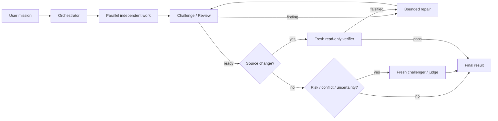

# Agent Workflow

[繁體中文](./README.md) | English

Agent Workflow 1.0 is the public baseline: a thin, native, quality-first
agent-team skill. When the
user explicitly asks for Agent Workflow, an agent team, parallel agents, or a
swarm, the current agent becomes the Orchestrator and uses Codex's native
collaboration tools to choose specialists, run independent work in parallel,
challenge claims, review artifacts, perform bounded repair, and finish with
fresh-context verification.

It does not use external model CLIs, App Server clients, or background processes
to launch agents. Tests, builds, linters, and task-specific scripts remain
available; agent lifecycle belongs entirely to native host tools.

## Usage

```text
Agent Workflow: investigate the cache invalidation bug, fix it, and have a fresh
verifier prove the result.
```

Or:

```text
Use an agent team to research three approaches in parallel, challenge the
assumptions, and give me an evidence-backed recommendation.
```

The user does not need to prescribe roles, agent count, review rounds, or who
plays adversary. The Orchestrator chooses them from the outcome, independence,
risk, and proof requirements.

## Core flow



### Speed

- Independent research, inspection, test design, and review lenses sharing the
  same upstream context launch together.
- Source writers run in parallel only with clearly disjoint ownership; otherwise
  one writer receives parallel read-only support.
- The Orchestrator does not duplicate active worker investigation or poll status.

### Quality

- Every specialist starts with `fork_turns=none` and a self-contained packet.
- A Challenger must provide a counterexample, failure mode, or missing evidence.
- Material findings return to the original owner for one bounded repair.
- Source changes finish with a fresh read-only verifier who did not author them.

### Safety and ownership

- Every agent owns a distinct outcome; duplicate agents are not added for show.
- Multiple writers require disjoint paths and semantic seams.
- Commit, push, PR, publish, deploy, release, production mutation, and outbound
  messages remain separate approval boundaries.

## Native tools

Agent lifecycle uses only native host capabilities:

- `spawn_agent`
- `send_message`
- `followup_task`
- `wait_agent`
- `interrupt_agent`

If native agent tools are unavailable, the skill reports that Agent Workflow is
unsupported instead of simulating a team.

## Model routing

The current native `spawn_agent` surface does not guarantee per-agent model or
reasoning overrides. This contract therefore uses semantic roles—Explorer,
Builder, Challenger, Reviewer, and Verifier. External CLI routing is outside the
contract. Optional routing can be added later without changing the core workflow
when the host exposes model-aware native spawn.

## Install and validate

Run a dry-run and inspect the diff first:

```bash
bash scripts/install-skill.sh agent-workflow \
  --target-root "${CODEX_HOME:-$HOME/.codex}/skills"
```

Apply only after review:

```bash
bash scripts/install-skill.sh agent-workflow \
  --target-root "${CODEX_HOME:-$HOME/.codex}/skills" \
  --execute
```

```bash
bash scripts/validate-skill.sh agent-workflow
```

Source, local production, and public release still use the repository's dry-run,
preflight, and human-approval gates.
