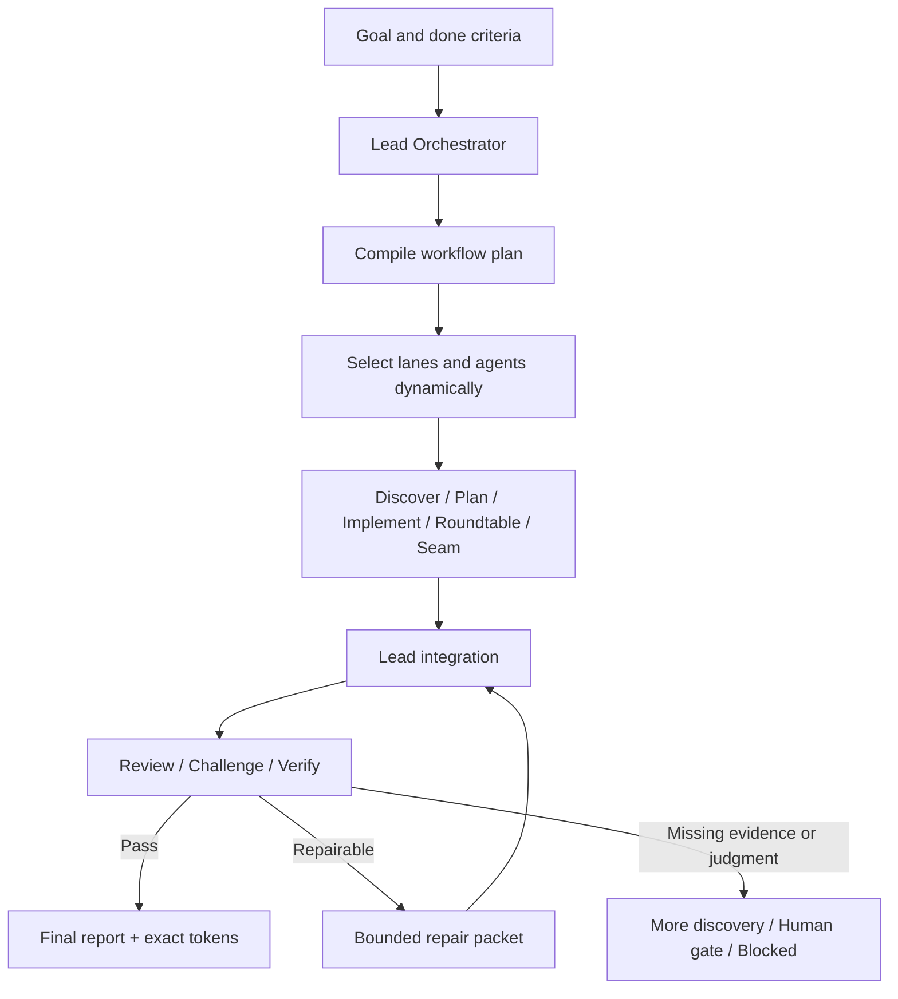

# Agent Workflow

[繁體中文](./README.md) | English

Agent Workflow is a planner-first multi-agent collaboration harness. It lets a
Lead Agent compile a goal into an executable team plan, then dynamically combine
discovery, planning, implementation, review, challenge, verification, and repair
lanes until the work passes, reaches a human decision, or hits an explicit stop
condition.

It is more than "spawn several agents at once." It provides state, quality
gates, and bounded multi-round iteration.

## What It Solves

Basic subagent dispatch often stops at "produce several answers in parallel and
let the main agent stitch them together." Agent Workflow adds several important
constraints:

- **Orchestrate before dispatch**: decide lanes, agent count, prompts, budgets,
  dependencies, gates, and stop conditions first.
- **Persist workflow state**: agents and rounds share contracts, outputs,
  evidence, and decisions under `.workflow/<slug>/`.
- **Use independent quality checks**: a writer cannot pass its own work using
  self-confidence alone; review, challenge, and verify use independent identities.
- **Feed failures into the next round**: verification can create a bounded repair
  packet and open a new `repair -> verify` round.
- **Make completion auditable**: the final gate requires evidence, finding
  resolution, terminal agent lifecycle, and exact token accounting.

## How It Works



The Lead Agent owns orchestration, integration, final writes, and final claims.
Integration is not a separate worker lane in v1, so the final responsibility
does not drift to another agent without the full picture.

## Dynamic Team Composition

The orchestrator does not enable every lane by default. It selects the smallest
team that is sufficient for the task's risk, ambiguity, and verification needs.

| Lane | Primary responsibility |
| --- | --- |
| `discover` | Map current state, constraints, evidence, risks, and unknowns |
| `plan` | Produce an executable decomposition, spec, or implementation path |
| `roundtable` | Build a tension network across competing perspectives |
| `implement` | Make changes within explicit ownership and write scope |
| `seam` | Inspect cross-module interfaces, ownership boundaries, and hidden coupling |
| `review` | Find correctness, scope, quality, and test problems |
| `challenge` | Adversarially attack assumptions, evidence gaps, and premature consensus |
| `verify` | Decide pass or fail using tests, sources, evidence, or expert judgment |
| `repair` | Execute a bounded repair packet produced by an earlier round |

Common workflow shapes:

```text
Small implementation: discover -> implement -> review -> verify
Specification:        discover -> roundtable -> plan -> challenge -> verify
Repair round:         repair -> verify
```

## Swarm Card

The Swarm Card is an event-driven status surface shown by the Lead Agent. It
uses a Markdown left rail instead of a fixed-width ASCII box, so mixed-width
English, Chinese, symbols, and font fallbacks do not break the layout.

### Preview

> **Agent Workflow · PREVIEW**
> `api-contract-hardening` · Round 1/3 · 0/5 complete · Codex native
> Tokens: measuring
>
> Fix API contract false-passes until no unresolved P2+ finding remains.
>
> **Discover**
> □ not started · `discover-01` · current-state explorer *(Terra)*
>
> **Implement & Repair**
> □ not started · `implement-01` · bounded writer *(Terra)*
>
> **Review & Challenge**
> □ not started · `review-01` · independent reviewer *(Sol)*
> □ not started · `challenge-01` · adversarial challenger *(Sol)*
>
> **Verify**
> □ not started · `verify-01` · evidence gate *(Sol)*
>
> **Gate** Pending · Open P2+: 0

### Verification Opens A Second Round

> **Agent Workflow · RUNNING**
> `api-contract-hardening` · Round 2/3 · 5/7 complete · Codex native
> Tokens: measuring
>
> Round 1 found a validator false-pass and opened a targeted repair packet.
>
> **Discover**
> ■ complete · `discover-01` · current-state explorer *(Terra)*
>
> **Implement & Repair**
> ■ complete · `implement-01` · bounded writer *(Terra)*
> ◐ running · `repair-01` · validator repair *(Terra)*
>
> **Review & Challenge**
> ■ complete · `review-01` · independent reviewer *(Sol)*
> ■ complete · `challenge-01` · adversarial challenger *(Sol)*
>
> **Verify**
> △ waiting: repair output · `verify-02` · regression gate *(Sol)*
>
> **Gate** Revise · Open P2+: 1

Symbols are scanning aids; the adjacent text is the authoritative label:

```text
□ not started   ◐ running   △ waiting   ■ complete
- skipped       ! blocked   × failed
```

The card displays the model only. The user-selected reasoning effort remains in
durable routing evidence but is intentionally hidden from the card. The card is
also display state, not runner evidence; it cannot prove that a native subagent
actually ran.

## Persistent Workflow Workspace

For multi-round work, collaboration, or resumable state, the Lead Agent creates:

```text
.workflow/<slug>/
├── plan.md
├── state.json
├── orchestration.md
├── orchestration.json
├── runner-evidence.json
├── swarm-card.json
├── token-usage.json
├── token-evidence.json
├── rounds/
│   └── round-001/
│       ├── lane-runs/
│       └── receipts/
├── integration.json
├── integration.md
└── final-report.md
```

Lane outputs use JSON contracts so later agents, rounds, and validators can read
the same durable state. Human-readable reasoning and outcomes live in the
orchestration, integration, and final report documents.

## Runner Modes

| Mode | Behavior |
| --- | --- |
| `codex_builtin_subagents` | A Codex Lead uses the native multi-agent tools |
| `claude_code_builtin_subagents` | A Claude Code Lead uses the native subagent or agent-team surface |
| `manual_simulation` | The Lead simulates lanes sequentially and explicitly states that no subagent ran |

Codex does not shell out to Claude Code, and Claude Code does not shell out to
Codex. Scripts handle scaffolding, digests, receipts, rendering, and validation;
they do not spawn agents.

## Optional Hardening

- **Execution efficiency**: isolated lane context, digest-bound dispatch,
  notification-first waits, compact receipts, budgets, and independent identities.
- **Codex model routing v2**: Sol handles planning, judgment, review, challenge,
  verification, and high-risk work; Terra handles bounded execution. The user's
  session reasoning effort is inherited across the workflow, and the router
  never changes effort per lane.
- **Exact token accounting**: computes Lead and registered-attempt usage from
  native runtime session events. Missing evidence fails closed instead of being
  replaced by an estimate labeled exact.

## When To Use It

Use Agent Workflow when:

- the user explicitly requests an agent workflow, agent team, swarm, or agent loop;
- the task needs multi-round repair and verification;
- a specification, research, or strategy problem needs structured disagreement;
- cross-module implementation needs seam review and independent quality gates; or
- the team needs resumable and auditable collaboration artifacts.

Do not use it for:

- a small change that one agent can complete directly;
- an ordinary request for a plan, review, or explanation; or
- the bare word "workflow" without multi-agent intent.

The governing principle is to use the smallest harness that materially raises
confidence, not to add agents for the appearance of a swarm.

## Get Started

Install the skill:

```bash
bash scripts/install-skill.sh agent-workflow \
  --target-root "${CODEX_HOME:-$HOME/.codex}/skills" \
  --execute
```

Then make the workflow intent explicit in a task:

```text
Use $agent-workflow to review this change, repair any P2+ findings,
and iterate until independent verification passes.
```

## Detailed Specifications

- [Skill contract](./SKILL.md)
- [Workflow artifacts](./references/workflow-artifacts.md)
- [Lane prompts](./references/reviewer-prompts.md)
- [Risk gates](./references/risk-gates.md)
- [Quality patterns](./references/quality-patterns.md)
- [Validation examples](./references/validation-examples.md)

## Boundary

Agent Workflow is a Lead-executed harness, not an unattended runner daemon. It
does not provide a background scheduler, queue, database, cross-runtime CLI
bridge, or independent provider attestation. Lead-recorded lifecycle and routing
evidence are labeled honestly and are never presented as third-party-signed
execution proof.
