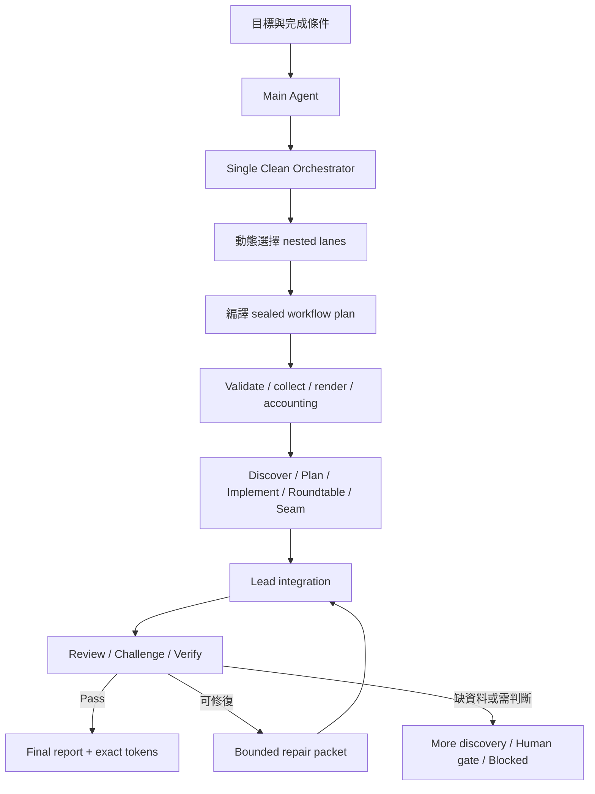

# Agent Workflow

繁體中文 | [English](./README.en.md)

把一個需要多個 agents、獨立品質檢查或多輪修復的目標交給 Agent Workflow。新的
Codex native 預設不是由 Main 直接 fan-out：Main 只建立一個 `fork_turns=none` 的 clean
Orchestrator；Orchestrator 先選擇 team、lanes、sealed gates、completion budgets 與停止
條件，再協調 nested workers、整合與品質 lanes。只有 gate 失敗時才開 repair round。

有 native subagent surface 且 capability admission 通過時，它會建立真正的 agent
team；能力不足時只能走明確有界的 `bounded_interim`，或在 spawn 前 fail closed。
沒有或未獲授權時，Lead 只能執行明確標示的 sequential simulation，不能宣稱
subagent 曾執行。它不是 unattended runner daemon。

## Agent Workflow vNext candidate

vNext 只在使用者明確要求 Agent Workflow 時啟動。Main 會建立一個乾淨的
Orchestrator；Orchestrator 依 sealed brief 動態規劃 phases，並由 deterministic runtime
協調外部 routed workers。這些 workers 會留下可稽核的 routing、result 與 receipt artifacts，
但它們不是 Codex native sub-agent tree，因此不會出現在原生 sub-agent 階層中。

`.workflow/<slug>/` 的 `view.json` 是提供人與 UI 使用的衍生狀態；真正 authority 來自 immutable、
digest-bound artifacts。完整 mechanics 見
[vNext runtime reference](./references/vnext-runtime-reference.md)。

**Legacy/native 0.x 邊界**：下方既有 lanes、rounds、Swarm Card、workspace tree、Runner
Modes 與 native runtime protections 描述尚未 cutover 的 0.x。vNext external runner 會啟動 routed workers；
legacy scripts 不會 spawn agents。vNext 不使用 legacy Swarm Card，唯一 guaranteed UI 是由 artifacts
重建的 `view.json`。

## 何時適合使用

適合：

- 明確要求 agent workflow、agent team、swarm 或 agent loop
- 任務需要多輪修復與 verification
- 規格、研究或策略問題需要 structured disagreement
- 跨模組實作需要 seam review 與獨立品質閘門
- 需要保留可恢復、可稽核的協作 artifacts

不適合：

- 一次就能完成的小修改
- 單純要求一份 plan、review、explanation 或 paste-ready goal text
- 只因為使用者說了普通的「workflow」一詞
- 需要背景 scheduler、queue 或無人值守 daemon

原則是使用「足以提高信心的最小 harness」，不是為了看起來像 swarm 而增加 agents。

## 開始使用

需要 Git、Bash、Python 3 與 `rsync`。Clone 此 repository 後，從 repository root
執行；完整安裝說明見 [repository Install](../../README.md#install)：

```bash
bash scripts/install-skill.sh agent-workflow \
  --target-root "${CODEX_HOME:-$HOME/.codex}/skills" \
  --execute
```

然後在任務中明確要求：

```text
Use $agent-workflow to review this change, repair any P2+ findings,
and iterate until independent verification passes.
```

## 它解決什麼問題

一般的 subagent dispatch 很容易停在「平行產出一批答案，最後由主 agent 自己
拼起來」。Agent Workflow 加上幾個關鍵約束：

- **先 orchestrate，再 dispatch**：先決定 lanes、agent 數量、prompts、budgets、
  dependencies、gates 與 stop conditions。
- **持久化 workflow state**：多個 agents 與多個 rounds 共用 `.workflow/<slug>/`
  內的 contracts、outputs、evidence 與 decisions。
- **非自我驗收**：writer 不能只靠自己的 confidence 宣告完成。Native runs 會使用
  獨立 agent identity；simulation 必須清楚標示 role separation 與執行限制。
- **失敗會回到下一輪**：verification 可以開出 bounded repair packet，再進入新的
  `repair -> verify` round。
- **可稽核的完成條件**：final gate 需要 evidence、finding resolution 與 terminal
  agent lifecycle；exact token accounting 只接受完整 runtime event evidence，並標為
  Lead-recorded provenance。

## 整體流程



Clean Orchestrator 是 workflow 內 orchestration、integration、最終寫入與最終 claims
的 Lead；Main 不直接管理 workers，也不接收 nested worker events。
Integration 在 v1 不是獨立 worker lane，避免把最後責任交給另一個無法統合全局的
agent。

## 動態組隊

Orchestrator 不會固定啟用所有 lanes。它會依任務風險、模糊度與驗證需求選擇最小但
足夠的 team。

| Lane | 主要任務 |
| --- | --- |
| `discover` | 盤點現況、限制、證據、風險與未知項目 |
| `plan` | 產出可執行的 decomposition、spec 或 implementation path |
| `roundtable` | 讓多個立場形成 tension network，而不是快速形成共識 |
| `implement` | 在明確 ownership 與 write scope 內完成修改 |
| `seam` | 檢查跨模組介面、ownership boundary 與 hidden coupling |
| `review` | 找 correctness、scope、quality 與 test 問題 |
| `challenge` | 對抗性攻擊假設、證據缺口與過早結論 |
| `verify` | 用測試、來源、evidence 或 expert judgment 判斷是否通過 |
| `repair` | 執行上一輪產生的 bounded repair packet |

常見的 workflow shape：

```text
小型實作：discover -> implement -> review -> verify
規格討論：discover -> roundtable -> plan -> challenge -> verify
修復回合：repair -> verify
```

## Swarm Card

以下只適用 legacy/native 0.x；vNext 不使用 legacy Swarm Card。Swarm Card 是 Lead Agent
對使用者顯示的 event-driven status surface。它使用
Markdown left rail，不依賴固定寬度 ASCII box，因此中英文與不同字型不會破版。

### Preview

> **Agent Workflow · PREVIEW**
> `api-contract-hardening` · Round 1/3 · 0/5 complete · Codex native
> Tokens: measuring
>
> 修復 API contract 的 false-pass，直到沒有未處理的 P2+ finding。
>
> **Discover**
> □ not started · `discover-01` · current-state explorer *(Terra)*
>
> **Implement & Repair**
> □ not started · `implement-01` · bounded writer *(Terra)*
>
> **Review & Challenge**
> □ not started · `review-01` · independent reviewer *(Sol)*
> □ not started · `challenge-01` · adversarial challenger *(Sol)*
>
> **Verify**
> □ not started · `verify-01` · evidence gate *(Sol)*
>
> **Gate** Pending · Open P2+: 0

### Verification 觸發第二輪

> **Agent Workflow · RUNNING**
> `api-contract-hardening` · Round 2/3 · 5/7 complete · Codex native
> Tokens: measuring
>
> Round 1 找到一個 validator false-pass，已開出 targeted repair packet。
>
> **Discover**
> ■ complete · `discover-01` · current-state explorer *(Terra)*
>
> **Implement & Repair**
> ■ complete · `implement-01` · bounded writer *(Terra)*
> ◐ running · `repair-01` · validator repair *(Terra)*
>
> **Review & Challenge**
> ■ complete · `review-01` · independent reviewer *(Sol)*
> ■ complete · `challenge-01` · adversarial challenger *(Sol)*
>
> **Verify**
> △ waiting: repair output · `verify-02` · regression gate *(Sol)*
>
> **Gate** Revise · Open P2+: 1

狀態符號只是掃讀輔助，旁邊的文字才是 authoritative label：

```text
□ not started   ◐ running   △ waiting   ■ complete
- skipped       ! blocked   × failed
```

Card 只顯示 model。使用者選定的 reasoning effort 仍保留在 routing evidence，但不會
出現在 Card。Card 也不是 runner evidence，不能用它證明某個 native subagent 確實
執行過。

## 持久化 Workflow Workspace

以下 tree 是 legacy/native 0.x 格式；vNext 使用 immutable Phase/Task artifacts 與 derived
`view.json`。需要多輪、多人協作或可恢復狀態時，legacy Lead Agent 會建立：

```text
.workflow/<slug>/
├── plan.md
├── state.json
├── orchestration.md
├── orchestration.json
├── runner-evidence.json
├── swarm-card.json
├── token-usage.json
├── token-evidence.json
├── rounds/
│   └── round-001/
│       ├── lane-runs/
│       ├── receipts/          # optional efficiency artifacts
│       ├── integration.json
│       └── integration.md
└── final-report.md
```

Lane outputs 使用 JSON contracts，讓後續 agents、rounds 與 validators 可以讀取同一
份 durable state。人類可讀的 reasoning 與結果則放在 orchestration、integration
與 final report。

## Runner Modes

本節只描述 legacy/native 0.x。vNext external runner 會啟動 routed workers；legacy scripts
不會 spawn agents。

| Mode | 行為 |
| --- | --- |
| `codex_builtin_subagents` | Codex Lead 使用原生 multi-agent tools 組隊 |
| `claude_code_builtin_subagents` | Claude Code Lead 使用原生 subagent 或 agent-team surface |
| `manual_simulation` | 沒有 native surface 時由 Lead 依序模擬 lanes，並明確標示沒有 subagent 執行 |

Codex 不會用 CLI 喚起 Claude Code，Claude Code 也不會用 CLI 喚起 Codex。Legacy scripts
負責 scaffold、digest、receipt、render 與 validation，不負責 spawn agents。

## Runtime 保護與可選強化

以下 protections 與 modes 只描述 legacy/native 0.x，不是 vNext external runner contract。

- **Execution efficiency（native 預設）**：Codex／Claude Code native workflow
  自動使用 isolated lane context、digest-bound dispatch、notification-first waits、
  compact receipts、budgets 與 independent identities；`off` 僅供明確 rollback。
- **Clean Orchestrator（Codex native 預設）**：Main 只有一個 clean child；每輪在
  dispatch 前封存 semantic gate graph、compound operation 與 absolute completion
  budget。`target` 要求 atomic outer primitive、true all-terminal barrier 與 terminal
  host finalization；缺能力時只能用 admission-bound 的 `bounded_interim`，不能退回
  Main-led fan-out 或 wrapper polling。
- **Portable controller**：`workflow_controller.py` 將 prepare、collect、render、
  validate 與 exact-accounting housekeeping 收進 typed compound receipts，但不 spawn、
  join、queue 或 rotate native agents，也不冒充 host atomicity。
- **Codex model routing v2（native 強制）**：新 Codex native workflow 一律啟用；
  Sol 負責 planning、judgment、review、challenge、verify 與高風險工作，Terra
  負責 bounded execution。Lead 會從 host tool schema 建立 capabilities，reasoning
  effort 則直接繼承目前 Codex session；缺少 `model`／`thinking` 控制或 runtime
  evidence 時在 dispatch 前 fail closed，不能用 `off` 繞過。Raw replay 會核對實際
  spawn 是否符合 ordered attempt，並驗證 child session 真正使用的 model 與 effort。
- **Exact token accounting**：從 native runtime session events 計算 Lead 與所有
  registered attempts，並保存綁定 event evidence 的 Lead-recorded provenance；無法取得
  完整 evidence 時 fail closed，不用估算值冒充 exact。
- **Raw completion replay**：`runtime_harness.py` 重新開啟 sealed runtime JSONL prefix，
  逐次產生 input context、completion class、round density 與 forbidden wake 計數；
  `runner-evidence.json` 只是 digest-bound projection，不能自填覆蓋 raw truth。

## 詳細規格

- [Skill contract](./SKILL.md)
- [Workflow artifacts](./references/workflow-artifacts.md)
- [Lane prompts](./references/reviewer-prompts.md)
- [Risk gates](./references/risk-gates.md)
- [Quality patterns](./references/quality-patterns.md)
- [Validation examples](./references/validation-examples.md)

## 邊界

Agent Workflow 不是 unattended runner daemon。Portable source 不提供 atomic
`run_orchestrator`、durable all-terminal barrier、native queue、generation rotation、
terminal host finalization、背景 scheduler、database、跨 runtime CLI bridge 或獨立
provider attestation。這些能力必須由 host attestation 通過；否則明確標示
`bounded_interim` 或 fail closed。
