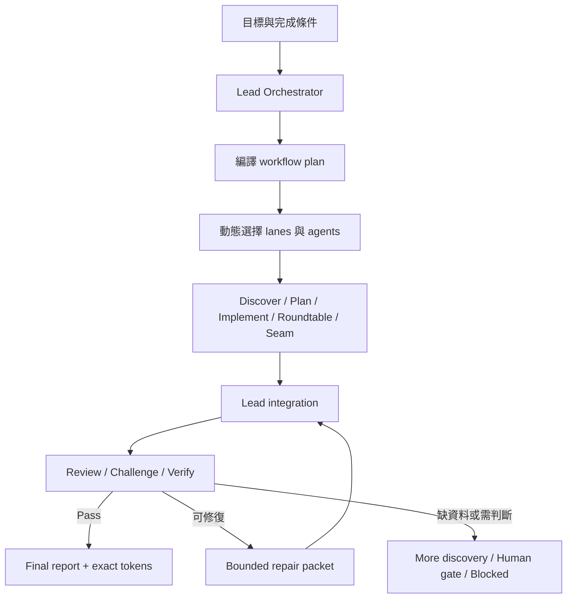

# Agent Workflow

繁體中文 | [English](./README.en.md)

Agent Workflow 是一個 planner-first 的多 agent 協作 harness。它讓 Lead
Agent 先把目標編譯成一個可執行的 team plan，再動態組合 discovery、planning、
implementation、review、challenge、verification 與 repair lanes，直到工作通過
驗證、需要人類判斷，或到達明確的停止條件。

它不只是「同時多叫幾個 agent」。它提供的是一個有狀態、有品質閘門、可以多輪
迭代的協作機制。

## 它解決什麼問題

一般的 subagent dispatch 很容易停在「平行產出一批答案，最後由主 agent 自己
拼起來」。Agent Workflow 加上幾個關鍵約束：

- **先 orchestrate，再 dispatch**：先決定 lanes、agent 數量、prompts、budgets、
  dependencies、gates 與 stop conditions。
- **持久化 workflow state**：多個 agents 與多個 rounds 共用 `.workflow/<slug>/`
  內的 contracts、outputs、evidence 與 decisions。
- **獨立品質檢查**：writer 不能只靠自己的 confidence 宣告完成；review、challenge
  與 verify 由獨立身份執行。
- **失敗會回到下一輪**：verification 可以開出 bounded repair packet，再進入新的
  `repair -> verify` round。
- **可稽核的完成條件**：final gate 需要 evidence、finding resolution、terminal
  agent lifecycle 與 exact token accounting。

## 整體流程



Lead Agent 是 orchestration、integration、最終寫入與最終 claims 的 owner。
Integration 在 v1 不是獨立 worker lane，避免把最後責任交給另一個無法統合全局的
agent。

## 動態組隊

Orchestrator 不會固定啟用所有 lanes。它會依任務風險、模糊度與驗證需求選擇最小但
足夠的 team。

| Lane | 主要任務 |
| --- | --- |
| `discover` | 盤點現況、限制、證據、風險與未知項目 |
| `plan` | 產出可執行的 decomposition、spec 或 implementation path |
| `roundtable` | 讓多個立場形成 tension network，而不是快速形成共識 |
| `implement` | 在明確 ownership 與 write scope 內完成修改 |
| `seam` | 檢查跨模組介面、ownership boundary 與 hidden coupling |
| `review` | 找 correctness、scope、quality 與 test 問題 |
| `challenge` | 對抗性攻擊假設、證據缺口與過早結論 |
| `verify` | 用測試、來源、evidence 或 expert judgment 判斷是否通過 |
| `repair` | 執行上一輪產生的 bounded repair packet |

常見的 workflow shape：

```text
小型實作：discover -> implement -> review -> verify
規格討論：discover -> roundtable -> plan -> challenge -> verify
修復回合：repair -> verify
```

## Swarm Card

Swarm Card 是 Lead Agent 對使用者顯示的 event-driven status surface。它使用
Markdown left rail，不依賴固定寬度 ASCII box，因此中英文與不同字型不會破版。

### Preview

> **Agent Workflow · PREVIEW**
> `api-contract-hardening` · Round 1/3 · 0/5 complete · Codex native
> Tokens: measuring
>
> 修復 API contract 的 false-pass，直到沒有未處理的 P2+ finding。
>
> **Discover**
> □ not started · `discover-01` · current-state explorer *(Terra)*
>
> **Implement & Repair**
> □ not started · `implement-01` · bounded writer *(Terra)*
>
> **Review & Challenge**
> □ not started · `review-01` · independent reviewer *(Sol)*
> □ not started · `challenge-01` · adversarial challenger *(Sol)*
>
> **Verify**
> □ not started · `verify-01` · evidence gate *(Sol)*
>
> **Gate** Pending · Open P2+: 0

### Verification 觸發第二輪

> **Agent Workflow · RUNNING**
> `api-contract-hardening` · Round 2/3 · 5/7 complete · Codex native
> Tokens: measuring
>
> Round 1 找到一個 validator false-pass，已開出 targeted repair packet。
>
> **Discover**
> ■ complete · `discover-01` · current-state explorer *(Terra)*
>
> **Implement & Repair**
> ■ complete · `implement-01` · bounded writer *(Terra)*
> ◐ running · `repair-01` · validator repair *(Terra)*
>
> **Review & Challenge**
> ■ complete · `review-01` · independent reviewer *(Sol)*
> ■ complete · `challenge-01` · adversarial challenger *(Sol)*
>
> **Verify**
> △ waiting: repair output · `verify-02` · regression gate *(Sol)*
>
> **Gate** Revise · Open P2+: 1

狀態符號只是掃讀輔助，旁邊的文字才是 authoritative label：

```text
□ not started   ◐ running   △ waiting   ■ complete
- skipped       ! blocked   × failed
```

Card 只顯示 model。使用者選定的 reasoning effort 仍保留在 routing evidence，但不會
出現在 Card。Card 也不是 runner evidence，不能用它證明某個 native subagent 確實
執行過。

## 持久化 Workflow Workspace

需要多輪、多人協作或可恢復狀態時，Lead Agent 會建立：

```text
.workflow/<slug>/
├── plan.md
├── state.json
├── orchestration.md
├── orchestration.json
├── runner-evidence.json
├── swarm-card.json
├── token-usage.json
├── token-evidence.json
├── rounds/
│   └── round-001/
│       ├── lane-runs/
│       └── receipts/
├── integration.json
├── integration.md
└── final-report.md
```

Lane outputs 使用 JSON contracts，讓後續 agents、rounds 與 validators 可以讀取同一
份 durable state。人類可讀的 reasoning 與結果則放在 orchestration、integration
與 final report。

## Runner Modes

| Mode | 行為 |
| --- | --- |
| `codex_builtin_subagents` | Codex Lead 使用原生 multi-agent tools 組隊 |
| `claude_code_builtin_subagents` | Claude Code Lead 使用原生 subagent 或 agent-team surface |
| `manual_simulation` | 沒有 native surface 時由 Lead 依序模擬 lanes，並明確標示沒有 subagent 執行 |

Codex 不會用 CLI 喚起 Claude Code，Claude Code 也不會用 CLI 喚起 Codex。Scripts
負責 scaffold、digest、receipt、render 與 validation，不負責 spawn agents。

## 可選的強化機制

- **Execution efficiency**：isolated lane context、digest-bound dispatch、notification-
  first waits、compact receipts、budgets 與 independent identities。
- **Codex model routing v2**：Sol 負責 planning、judgment、review、challenge、verify
  與高風險工作；Terra 負責 bounded execution。Reasoning effort 由使用者 session
  選定後整個 workflow 繼承，router 不會替每個 lane 任意切換 effort。
- **Exact token accounting**：從 native runtime session events 計算 Lead 與所有
  registered attempts；無法取得完整 evidence 時 fail closed，不用估算值冒充 exact。

## 何時適合使用

適合：

- 明確要求 agent workflow、agent team、swarm 或 agent loop
- 任務需要多輪修復與 verification
- 規格、研究或策略問題需要 structured disagreement
- 跨模組實作需要 seam review 與獨立品質閘門
- 需要保留可恢復、可稽核的協作 artifacts

不適合：

- 一次就能完成的小修改
- 單純要求一份 plan、review 或 explanation
- 只因為使用者說了普通的「workflow」一詞

Agent Workflow 的原則是使用「足以提高信心的最小 harness」，不是為了看起來像
swarm 而增加 agents。

## 開始使用

安裝 skill：

```bash
bash scripts/install-skill.sh agent-workflow \
  --target-root "${CODEX_HOME:-$HOME/.codex}/skills" \
  --execute
```

然後在任務中明確要求：

```text
Use $agent-workflow to review this change, repair any P2+ findings,
and iterate until independent verification passes.
```

## 詳細規格

- [Skill contract](./SKILL.md)
- [Workflow artifacts](./references/workflow-artifacts.md)
- [Lane prompts](./references/reviewer-prompts.md)
- [Risk gates](./references/risk-gates.md)
- [Quality patterns](./references/quality-patterns.md)
- [Validation examples](./references/validation-examples.md)

## 邊界

Agent Workflow 是由 Lead Agent 執行的 harness，不是 unattended runner daemon。
它不提供背景 scheduler、queue、database、跨 runtime CLI bridge 或獨立的 provider
attestation。Lead-recorded lifecycle 與 routing evidence 會被誠實標示，不會被描述成
第三方簽署的執行證明。
