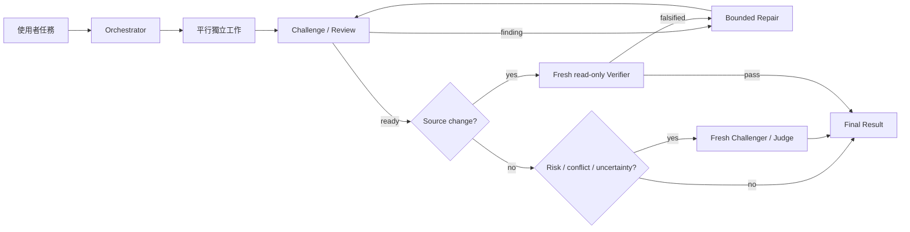

# Agent Workflow

繁體中文 | [English](./README.en.md)

Agent Workflow 1.0 是這個 skill 的公開起點：一個 thin、native、quality-first 的 agent team
skill。使用者只要明確說
「Agent Workflow」、「agent team」、「parallel agents」或「用多個 agents」，目前的 agent
就會成為 Orchestrator，使用 Codex 原生 collaboration tools 自動組隊、平行分工、對抗、review、
repair 與 fresh-context verification。

它不使用外部 model CLI、App Server client 或背景 process 啟動 agents。普通任務需要的測試、
build、lint、資料處理指令仍可使用；agent lifecycle 完全由 host native tools 負責。

## 使用方式

```text
Agent Workflow：研究目前 cache invalidation 的問題，修好它，並讓 fresh verifier 驗證。
```

或：

```text
請用 agent team 平行研究三種方案，互相 challenge，最後給我有證據的建議。
```

使用者不需要自行指定 roles、agents、review rounds 或誰負責拮抗。Orchestrator 會從目標、
可平行性、風險與驗證需求動態決定。

## 核心流程



### 速度

- 同一 upstream context 下的獨立研究、inspection、test design 與 review lenses 會一起啟動。
- Source writers 只有在 write ownership 明確互斥時才平行；否則使用單一 writer 加平行 read-only 支援。
- Orchestrator 不重做 worker 正在做的調查，也不輪詢狀態。

### 品質

- 每個 specialist 用 `fork_turns=none` 取得 fresh context，不繼承對話的 framing bias。
- Challenger 必須提出反例、失敗模式或缺失證據，不接受空泛意見。
- Finding 回到原 owner 做一次 bounded repair；沒有新證據就不重開同一 loop。
- Source change 最後一定交給沒寫過該變更的 fresh read-only verifier。

### 安全與 ownership

- 一個 agent 只擁有一個清楚 outcome；不為了看起來像 swarm 而複製 agents。
- 多 writer 只允許 disjoint paths／seams，重疊或不確定時降為單一 writer。
- Commit、push、PR、publish、deploy、release、production mutation 與對外訊息仍是獨立 approval boundary。

## Native tools

Agent lifecycle 只使用 host 原生能力：

- `spawn_agent`
- `send_message`
- `followup_task`
- `wait_agent`
- `interrupt_agent`

若 host 沒有 native agent tools，skill 會誠實回報 unsupported，不會模擬一個不存在的 team。

## Model routing

Codex 目前的 native `spawn_agent` surface 不保證 per-agent model／reasoning override。這個
contract 因此以 Explorer、Builder、Challenger、Reviewer、Verifier 等 semantic roles 管理
獨立性，不以外部 CLI 強制 Sol／Terra routing。未來 host 原生支援 model-aware spawn 時，
可以在不改變核心 workflow 的前提下加入 optional routing。

## 安裝與驗證

先 dry-run 並檢查 diff：

```bash
bash scripts/install-skill.sh agent-workflow \
  --target-root "${CODEX_HOME:-$HOME/.codex}/skills"
```

確認後才套用：

```bash
bash scripts/install-skill.sh agent-workflow \
  --target-root "${CODEX_HOME:-$HOME/.codex}/skills" \
  --execute
```

```bash
bash scripts/validate-skill.sh agent-workflow
```

Source、local production 與公開 release 仍走 repository 的 dry-run、preflight 與 human approval gates。
