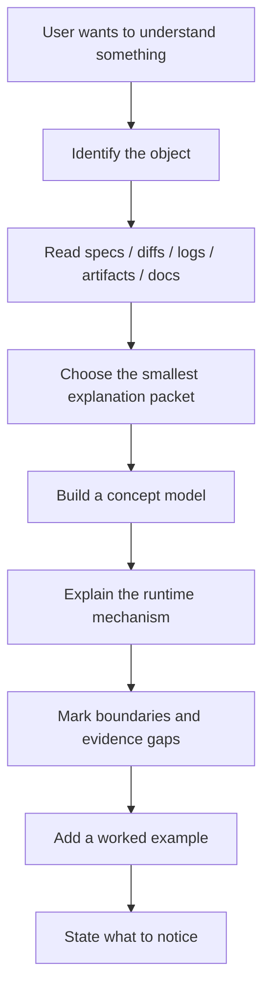
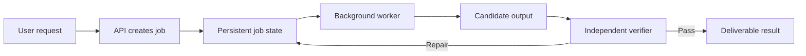

# Explain

[繁體中文](./README.md) | English

Give Explain a complex technical system, specification, diff, workflow,
artifact, or multi-round history. It reads current evidence first, then returns
an explanation packet that can be understood in one pass: what it is, why it
matters, how it works, where the boundaries are, and what remains unproven.

Explain reorganizes complexity instead of making the subject shallow. It does
not judge correctness or implement changes; use the appropriate review workflow
first when judgment is needed, then use Explain to communicate the result.

## When To Use It

Use Explain for questions such as:

- "How does this system actually work?"
- "What is this specification really trying to build?"
- "What happened across these agent workflow rounds?"
- "Which responsibilities and runtime behaviors changed in this diff?"
- "What is complete, and what is still missing?"
- "Show it with a diagram, timeline, or concrete example."

Do not use it to:

- answer a simple fact or only reformat information;
- find bugs or perform code review, audit, or blame analysis;
- challenge a plan;
- implement changes; or
- quiz the user.

## Get Started

Requires Git, Bash, Python 3, and `rsync`. After cloning this repository, run
from its root; see [repository Install](../../README.md#install) for the complete
installation path:

```bash
bash scripts/install-skill.sh explain \
  --target-root "${CODEX_HOME:-$HOME/.codex}/skills" \
  --execute
```

Example prompt:

```text
Use $explain to show me what changed across these three workflow rounds,
why it matters, and what is still not proven.
```

## What It Solves

Technical work is often explained in two unhelpful ways:

- It repeats filenames, classes, commits, and jargon without showing how the
  system behaves.
- It simplifies away responsibility boundaries until "implemented," "verified,"
  and "expected to work" sound like the same claim.

Explain instead:

- reads current evidence before describing existing state;
- defines a project term by responsibility before relying on its name;
- chooses diagrams, sequences, state machines, decision tables, or timelines
  based on the structure of the subject;
- separates confirmed facts, evidence boundaries, and unproven claims; and
- includes a worked example for non-trivial subjects.

## Comprehension Flow



## Default Explanation Packet

A small question may need only one or two paragraphs. A non-trivial explanation
usually follows this spine:

1. **One-line answer**: give the reader the whole shape first.
2. **Evidence checked**: name the current sources that were read.
3. **What this is**: define the subject and its responsibilities.
4. **Why it matters**: explain which decisions or behaviors change.
5. **Concept model**: show the named parts and their relationships.
6. **Mechanism**: explain how data, events, or control move.
7. **Boundaries / not included**: prevent reasonable but incorrect extensions.
8. **Status / timeline**: represent phases, rounds, or completion when relevant.
9. **Worked example**: run one concrete scenario through the model.
10. **What to notice**: reduce the explanation to the key takeaways.

## Choosing The Right Representation

Explain does not force every subject into the same diagram.

| What needs to be understood | Default representation |
| --- | --- |
| Components, responsibilities, boundaries | Component or concept diagram |
| Request, event, or agent flow | Sequence diagram |
| Lifecycle and state change | State machine |
| Routing, permissions, and classification | Decision table |
| Data structures and relations | ER diagram or object model |
| UI or artifact shape | Wireframe or annotated mock |
| Goals, phases, and rounds | Status table or timeline |
| Likely misunderstandings | `Assumption / Reality / Why it matters` table |

## A Small Example

Suppose the user asks: "What actually changed when document processing moved
from a synchronous request to a background job?"

Explain does not stop at listing the diffs in `api.py`, `worker.py`, and
`state.py`. It first builds a concept model:



It then separates "recoverable" from "cannot fail":

| Assumption | Reality | Why it matters |
| --- | --- | --- |
| A background job cannot fail | It can fail, but now has durable state and checkpoints | Recoverable does not mean failure-free |
| Worker completion means the result is correct | A verifier checks the candidate output independently | Execution and delivery quality are separate gates |
| The new path means old data was migrated | Evidence may only cover newly created jobs | A live code path is not proof of completed migration |

See the full progress/change example in
[`examples/progress-change-comprehension.md`](./examples/progress-change-comprehension.md).

## Evidence-first Rules

When explaining existing state, prefer:

- the specification, plan, or draft itself;
- the current diff, touched files, and relevant architecture docs;
- workflow state, round outputs, goal state, or final artifacts;
- logs, result files, and runtime state; and
- official documentation or primary sources for external technology.

When evidence is incomplete, Explain says "I did not see evidence that..."
instead of turning absence from the checked material into proof of nonexistence.

## Language And Audience

The default reader understands ordinary product, engineering, and CS concepts
but has not worked on this project. Explain does not reteach `adapter`, `state
machine`, or `DTO`, but it does define what project-specific names are
responsible for.

Reply in the user's language. When Chinese is requested without a specified
variant, default to Traditional Chinese. Keep APIs, commands, paths, and code
identifiers in their original English form.

## Detailed Specifications

- [Skill contract](./SKILL.md)
- [Progress/change example](./examples/progress-change-comprehension.md)

## Boundary

Explain aims to express the understanding supported by the evidence it read. A
polished packet does not upgrade an unverified claim into a fact, and the skill
does not quietly add recommendations, critique, or review findings unless the
user asks for them.
