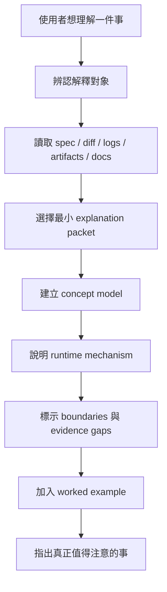
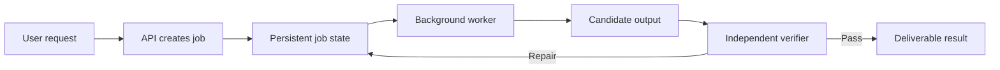

# Explain

繁體中文 | [English](./README.en.md)

把一個複雜的技術系統、spec、diff、workflow、artifact 或多輪進度交給 Explain，
它會先讀 current evidence，再產出一份可以一次讀懂的 explanation packet：這是什麼、
為什麼重要、怎麼運作、邊界在哪裡，以及什麼仍未被證明。

Explain 重組複雜度，不把內容變淺。它不判斷 correctness，也不實作修改；需要 review
時先使用適合的 review workflow，再用 Explain 呈現結果。

## 何時使用

適合：

- 「這個系統到底怎麼運作？」
- 「這個 spec 真正想做什麼？」
- 「這幾輪 agent workflow 都在做什麼？」
- 「這個 diff 改變了哪些責任和 runtime behavior？」
- 「現在完成了什麼，還有什麼沒做？」
- 「用圖、timeline 或具體例子說明。」

不適合：

- 簡單 factual answer 或單純重新排版
- 找 bug、code review、audit 或 blame analysis
- challenge 一份計畫
- 直接實作或修改程式
- 產生測驗或考使用者

## 開始使用

需要 Git、Bash、Python 3 與 `rsync`。Clone 此 repository 後，從 repository root
執行；完整安裝說明見 [repository Install](../../README.md#install)：

```bash
bash scripts/install-skill.sh explain \
  --target-root "${CODEX_HOME:-$HOME/.codex}/skills" \
  --execute
```

使用範例：

```text
Use $explain to show me what changed across these three workflow rounds,
why it matters, and what is still not proven.
```

## 它解決什麼問題

技術工作常有兩種不理想的解釋：

- 只重述檔名、class、commit 與 jargon，讀者知道改了什麼字，卻不知道系統怎麼動。
- 為了簡單而省略責任邊界，讓「已實作」、「已驗證」與「預期會有效」混成同一件事。

Explain 會：

- 先讀現有 evidence，不從模糊記憶描述當前狀態。
- 在使用專案名詞前，先定義它負責什麼、為什麼存在、和其他部分怎麼互動。
- 依內容選擇 diagram、sequence、state machine、decision table 或 timeline。
- 把 confirmed fact、evidence boundary 與尚未證明的 claim 分開。
- 對非簡單主題提供一個 worked example，讓抽象機制落到具體情境。

## 理解流程



## 預設 Explanation Packet

小問題可以只用一兩段回答。非簡單問題通常使用這個 spine：

1. **一句話答案**：先讓讀者知道整體結論。
2. **Evidence checked**：說明讀了哪些 current sources。
3. **What this is**：定義主體與責任。
4. **Why it matters**：說明它改變了什麼決策或行為。
5. **Concept model**：畫出 named parts 與關係。
6. **Mechanism**：解釋資料、事件或控制如何流動。
7. **Boundaries / not included**：阻止合理但錯誤的延伸解讀。
8. **Status / timeline**：需要時表示 phases、rounds 或完成度。
9. **Worked example**：用真實或貼近使用者的情境跑一次。
10. **What to notice**：收斂成幾個應該帶走的理解。

## 選擇正確的外部表示

Explain 不會把所有東西都硬畫成同一種圖。

| 想理解的內容 | 預設表示方式 |
| --- | --- |
| 元件、責任與邊界 | Component 或 concept diagram |
| Request、event 或 agent flow | Sequence diagram |
| Lifecycle 與狀態變化 | State machine |
| Routing、權限與分類規則 | Decision table |
| Data structures 與 relations | ER diagram 或 object model |
| UI 或 artifact 長相 | Wireframe 或 annotated mock |
| Goal、phases 與 rounds | Status table 或 timeline |
| 容易誤解的邊界 | `Assumption / Reality / Why it matters` table |

## 一個簡化範例

假設使用者問：「這次把同步文件處理改成 background job，到底差在哪裡？」

Explain 不會只列出 `api.py`、`worker.py` 和 `state.py` 的 diff。它會先建立概念模型：



接著用 boundary table 區分「可恢復」和「不會失敗」：

| Assumption | Reality | Why it matters |
| --- | --- | --- |
| Background job 不會失敗 | 它仍會失敗，但現在有 durable state 與 checkpoint | 可恢復不等於不會失敗 |
| Worker 完成代表結果正確 | Verifier 會獨立檢查 candidate output | 執行成功與交付品質是不同 gates |
| 新流程代表舊資料已遷移 | Evidence 可能只證明新建立的 jobs 使用新路徑 | 不應把 code path 上線解讀成 migration 完成 |

完整的 progress/change 範例在
[`examples/progress-change-comprehension.md`](./examples/progress-change-comprehension.md)。

## Evidence-first 規則

Explain 目前狀態時，應優先讀取：

- spec、plan 或 draft 本身
- current diff、touched files 與相關 architecture docs
- workflow state、round outputs、goal state 或 final artifacts
- logs、result files 與 runtime state
- external technology 的 official docs 或 primary sources

如果 evidence 不完整，它會說「我沒有看到證據顯示……」，而不是把沒有找到的東西
宣告成確定不存在。

## 語言與讀者

預設讀者是懂一般 product、engineering 與 CS 概念，但沒有參與這個 project 的協作
者。它不會重教 `adapter`、`state machine` 或 `DTO`，但會解釋 project-specific 名稱
實際負責什麼。

回覆使用者的語言；中文不明確時預設使用繁體中文。API、commands、paths 與 code
identifiers 保留原本的 English 名稱。

## 詳細規格

- [Skill contract](./SKILL.md)
- [Progress/change example](./examples/progress-change-comprehension.md)

## 邊界

Explain 追求的是「正確表達已讀 evidence 所支持的理解」。它不會因為輸出看起來完整，
就把未驗證的 claim 升級成事實；也不會在未被要求時偷偷加入 recommendations、
critique 或 review findings。
