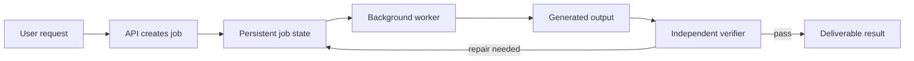
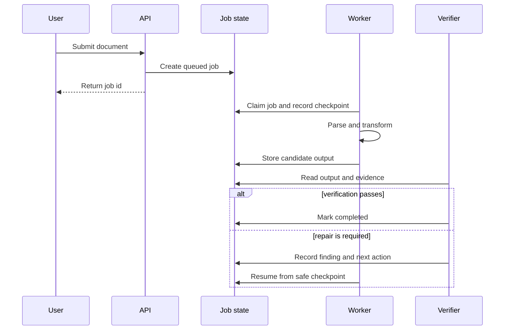

# Progress / Change Comprehension Example

User request:

> 請用 `$explain` 說明這個文件處理系統最近三個 phases 到底改了什麼。

Output:

一句話：這三個 phases 把文件處理從單一步驟的同步工作，改成可恢復的背景流程；系統現在會保存每一步狀態、獨立驗證輸出，並讓失敗工作從安全位置重跑。

## Evidence checked

- `docs/architecture/document-processing.md`
- `docs/changelog/background-processing.md`
- workflow state and verification artifacts for phases 1-3
- the diff affecting the request route, worker, state store, and verifier

## What this is

這是一段「文件怎麼被處理」的架構替換。舊流程收到請求後，會在同一個 request 裡完成解析、轉換和輸出。新流程則先建立一筆持久化 job，再由背景 worker 執行各步驟並保存 checkpoint。

它不是單純把原本的 function 搬到背景執行。真正的改變是系統開始明確區分：誰接受請求、誰執行工作、狀態寫在哪裡，以及誰負責確認結果可以交付。

## Why it matters

舊流程只要其中一步超時，整個 request 就會失敗，而且系統很難知道已經完成到哪裡。新流程可以顯示目前階段、從 checkpoint 恢復，並把「worker 說完成」和「結果通過驗證」分成兩件事。

## Concept model

| Part | Responsibility |
|---|---|
| API | 接受請求並建立 job，不等待完整處理完成 |
| Job state | 保存目前 phase、checkpoint、錯誤與輸出位置 |
| Worker | 執行解析與轉換，不自行宣告最終可交付 |
| Verifier | 依 evidence 判斷輸出是否通過交付條件 |

## Mechanism

## Boundaries / not included

| Assumption | Reality | Why this matters |
|---|---|---|
| 背景執行代表永遠不會失敗 | 工作仍可能失敗，但現在有明確狀態與恢復位置 | 可恢復不等於不會失敗 |
| Worker 完成就代表結果正確 | Verifier 會獨立檢查候選輸出 | 執行成功和交付品質是不同 gate |
| 所有舊 job 都已自動遷移 | Checked evidence 只證明新建立的 job 使用新流程 | 不應把新路徑上線解讀成歷史資料遷移完成 |
| Retry 會從頭重做所有工作 | 新流程設計為從有效 checkpoint 恢復 | 這是降低重工與重複副作用的主要機制 |

## Status table

| Phase | Goal | Status | Evidence boundary |
|---|---|---|---|
| 1 | 建立持久化 job 與背景 worker | Completed | 已證明正常工作可完成 |
| 2 | 增加 checkpoint 與恢復流程 | Completed | 已測試已知 failure classes |
| 3 | 增加獨立 verification gate | Completed | 尚未證明所有真實文件格式都穩定 |

## Worked example

一份文件在轉換階段因外部服務短暫失敗。舊流程會讓整個 request timeout，使用者只能重新提交。新流程會把 job 留在 `transforming`，保存已完成的解析結果；retry 從轉換 checkpoint 繼續，而不是重新解析。Worker 產生輸出後，Verifier 仍會檢查頁數、必要欄位與錯誤清單，再決定是否標記完成。

## What to notice

- 核心改變是建立可持久化、可恢復、可獨立驗證的 lifecycle。
- API、Worker 和 Verifier 的責任現在分開。
- Phase 完成證明指定 contract 已落地，不等於所有 production 輸入都已被窮舉驗證。
- Retry 的價值來自 checkpoint，而不只是「再跑一次」。
