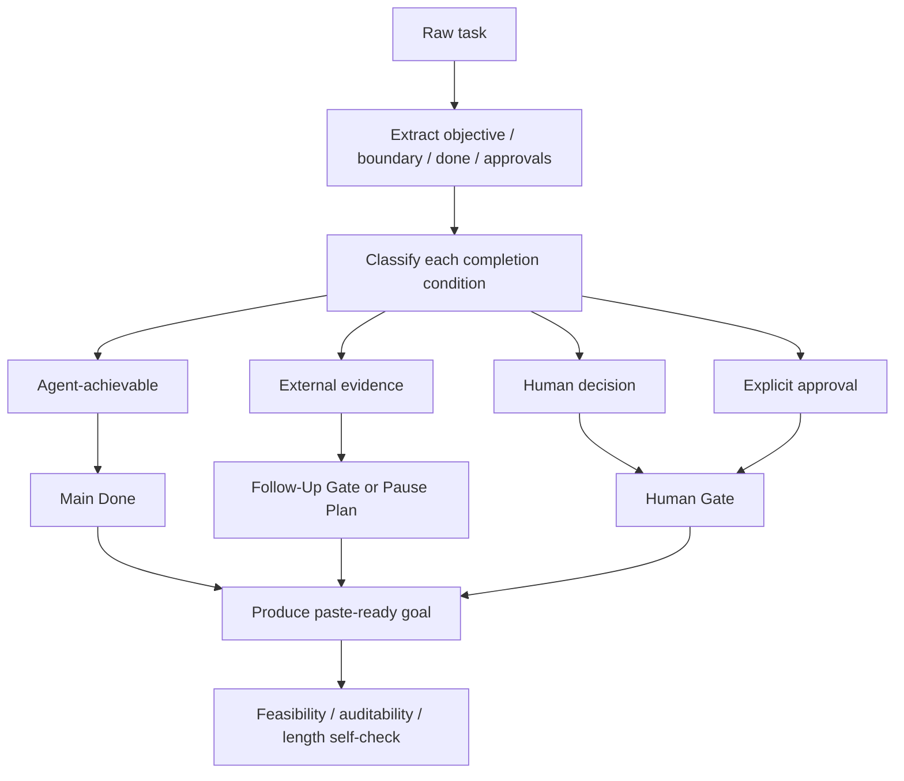

# Write Good Goal

[繁體中文](./README.md) | English

Write Good Goal turns a vague, oversized, or predictably blocked task into an
executable goal that can be pasted directly into Codex or Claude Code Goal Mode.
It checks feasibility before writing the objective, boundary, auditable Done
criteria, round-selection loop, human gates, and pause/resume conditions.

The point is not to make the request longer. The point is to tell the agent how
to make progress, how to know it is done, and when to pause honestly.

## What It Solves

A goal can look complete while being impossible to finish inside an agent run.
For example, it may:

- put "observe production metrics for two weeks" inside the current Done state;
- disguise a product or policy judgment as deterministic verification;
- say "make quality good enough" without an observable pass condition; or
- keep adding documents, tools, and process after a blocker without getting
  closer to the requested outcome.

Write Good Goal separates what the agent can complete now from what genuinely
depends on future evidence, human judgment, or explicit approval.

## Goal Compilation Flow



## Four Completion Classes

| Class | Definition | Where it belongs |
| --- | --- | --- |
| Agent-achievable | The agent can produce or verify it within normal rounds | `Done` |
| External evidence | It depends on elapsed time, future data, a scheduled run, or third-party state | `Follow-Up Gate` or `Risk / Pause Plan` |
| Human decision | Product, policy, or semantic judgment that deterministic checks cannot decide | `Human Gate` |
| Approval | An irreversible action, external action, or scope change needs explicit permission | `Human Gate` / boundary |

This routing prevents an agent from pretending that future evidence exists just
to mark the goal complete.

## Standard Goal Shape

The default output stays under 4,000 Unicode characters and preserves the most
important contract:

```text
Goal:
[One-sentence objective.]

Boundary:
- Use: [...]
- Do not use: [...]
- Approval needed: [...]

Done:
- [Observable, verifiable criterion.]
- [Observable, verifiable criterion.]

Follow-Up Gate:
- [Future evidence that cannot exist during this run.]

Loop:
Before each round, compare up to three next moves by expected increment,
expected state change, and cost or risk. Choose the best expected progress.

Human Gate:
Ask only when deterministic verification cannot decide correctness or
explicit approval is required.

Round Report:
- selected move
- increment type
- expected and actual state change
- verification
- next decision
```

Add `Feasibility Warning` or `Risk / Pause Plan` only when the goal genuinely
needs one.

## Before / After

Raw request:

```text
Make the retry system stable, observe production for two weeks to confirm it,
and keep improving until there are no problems.
```

This mixes engineering work that can happen now with acceptance evidence that
cannot exist for two weeks. Write Good Goal produces something like:

```text
Goal:
Fix known retry failure paths and establish a verifiable reliability baseline.

Boundary:
- Use: current retry implementation, failure logs, deterministic tests.
- Do not use: invented production observations or unrelated refactors.
- Approval needed: production rollout or irreversible data changes.

Done:
- Known retry failure classes have regression tests.
- P0/P1 defects are fixed; remaining findings have explicit dispositions.
- Local and staging verification pass with preserved evidence.

Follow-Up Gate:
- Two weeks of production error rate and retry success rate meet the acceptance threshold.

Loop:
Compare Outcome, Evidence, and Capability increments each round. Choose the move
that best advances Done. Do not exceed five consecutive Capability-only rounds.

Human Gate:
Ask only for rollout approval or product judgment on the acceptance threshold.
```

The engineering goal can now complete. The two-week observation remains visible
without being misrepresented as evidence available in the current run.

## Round Selection

Compare at most three next moves before each round:

| Increment | Meaning | Example |
| --- | --- | --- |
| `Outcome` | The target artifact or result improves | Fix a bug, complete a spec, reduce failing cases |
| `Evidence` | Trustworthy evidence of correctness or completion increases | Add a regression test, verify a source, reproduce a failure |
| `Capability` | A named blocker is removed | Build a required fixture, obtain missing data |

Prefer Outcome or Evidence when options are similarly feasible. Allow no more
than five consecutive Capability-only rounds, so the agent cannot endlessly
build tools, organize documents, or expand process without improving the result.

## Paused Is Not Complete

Pause when the next necessary state change depends on future evidence, elapsed
time, human judgment, or approval, and no remaining agent-achievable increment
would materially advance Done.

A pause report includes:

- the current proven state;
- the missing trigger or evidence;
- the exact resume condition; and
- an optional monitor or scheduled check when supported.

A paused goal is not a completed goal. It is stopped at an honest, resumable
boundary.

## When To Use It

Use Write Good Goal to:

- write or refine a Codex or Claude Code goal;
- turn a large task into a bounded multi-round objective;
- audit whether a goal is actually feasible and verifiable;
- design an agent loop, dynamic workflow, or long-running project objective; or
- separate future acceptance from current implementation.

Do not use it to:

- execute the goal itself;
- expand the goal into a full project plan or ticket set;
- replace product, policy, or safety approval; or
- hide missing pass conditions behind vague quality language.

## Get Started

Install the skill:

```bash
bash scripts/install-skill.sh write-good-goal \
  --target-root "${CODEX_HOME:-$HOME/.codex}/skills" \
  --execute
```

Example prompt:

```text
Use $write-good-goal to turn this project into a goal that can make progress
without pretending future production evidence already exists.
```

## Detailed Specifications

- [Skill contract and full template](./SKILL.md)

## Boundary

Write Good Goal produces a goal contract, not the task result. It minimizes
unnecessary human questions without removing genuine semantic judgment,
external approval, or safety boundaries.
