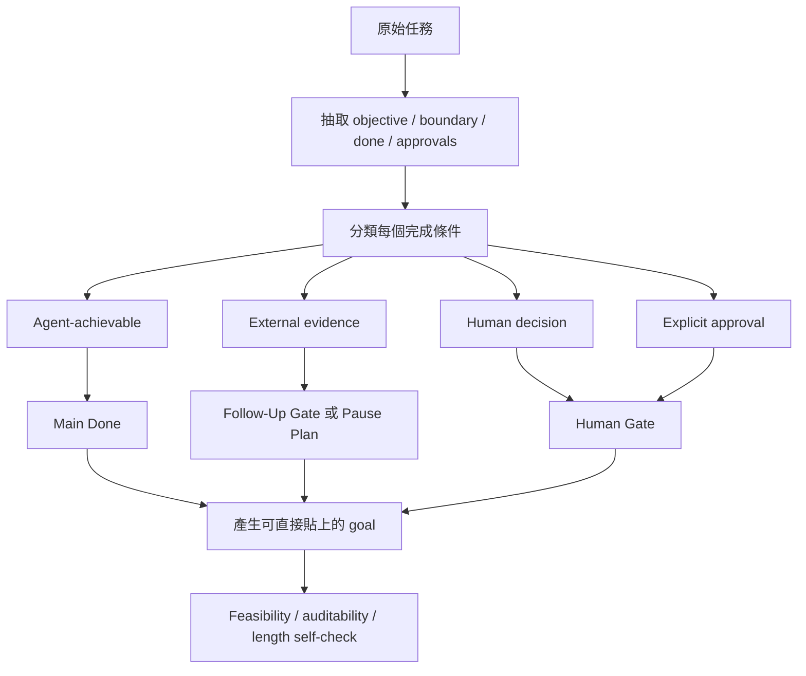

# Write Good Goal

繁體中文 | [English](./README.en.md)

把一個模糊、過大或容易卡住的 coding-agent 任務交給 Write Good Goal，它會先檢查
feasibility，再回傳一份可以直接貼進 Codex 或 Claude Code 的 goal contract：明確
boundary、agent-achievable Done criteria、每輪選擇方式，以及必要的 follow-up 或
human gates。

它產出 goal text，不執行 goal，也不把 goal 膨脹成完整 project plan。重點不是把
要求寫得更長，而是讓 agent 知道怎麼前進、怎麼判斷完成，以及何時應該誠實暫停。

## 何時使用

適合：

- 撰寫、改進或稽核 Codex / Claude Code goal text
- 把大型 coding-agent 任務變成 bounded multi-round objective
- 修正依賴 future evidence、elapsed time 或 human decision 的 Done criteria
- 把 future acceptance 與 current implementation 分開

不適合：

- 直接執行 goal 或組建 agent team
- 把 goal 展開成完整 project plan 或 tickets
- 一般 business OKR 或沒有 coding-agent context 的個人目標
- 取代產品、政策或安全 approval

## 開始使用

需要 Git、Bash、Python 3 與 `rsync`。Clone 此 repository 後，從 repository root
執行；完整安裝說明見 [repository Install](../../README.md#install)：

```bash
bash scripts/install-skill.sh write-good-goal \
  --target-root "${CODEX_HOME:-$HOME/.codex}/skills" \
  --execute
```

使用範例：

```text
Use $write-good-goal to turn this project into a goal that can make progress
without pretending future production evidence already exists.
```

## 它解決什麼問題

一個看起來完整的 goal，可能實際上永遠無法在 agent run 裡完成。例如：

- 把「觀察兩週 production 指標」放進現在這一輪的 Done。
- 把需要產品或政策判斷的問題偽裝成 deterministic verification。
- 只寫「做到品質夠好」，沒有 observable pass condition。
- 遇到 blocker 後持續增加文件、工具或 process surface，卻沒有讓結果更接近 Done。

Write Good Goal 會把這些條件拆成 agent 現在能完成的部分，以及真正需要 future
evidence、human judgment 或 explicit approval 的 gates。

## Goal 編譯流程



## 四種完成條件

| 類型 | 定義 | 放置位置 |
| --- | --- | --- |
| Agent-achievable | Agent 可以在正常 rounds 內產出或驗證 | `Done` |
| External evidence | 依賴 elapsed time、future data、scheduled run 或 third-party state | `Follow-Up Gate` 或 `Risk / Pause Plan` |
| Human decision | Deterministic checks 無法判斷的產品、政策或語意選擇 | `Human Gate` |
| Approval | Irreversible action、external action 或 scope change 需要明確允許 | `Human Gate` / boundary |

這個分流避免 agent 為了「完成 goal」而假裝未來證據已經存在。

## 標準 Goal Shape

預設輸出不超過 4000 Unicode characters，並保留最重要的 contract：

```text
Goal:
[一句話 objective]

Boundary:
- Use: [...]
- Do not use: [...]
- Approval needed: [...]

Done:
- [可觀察、可驗證的 criterion]
- [可觀察、可驗證的 criterion]

Follow-Up Gate:
- [Optional；本輪不可能取得的 future evidence]

Loop:
Before each round, compare up to three next moves by expected increment,
expected state change, and cost or risk. Choose the best expected progress.

Human Gate:
Ask only when deterministic verification cannot decide correctness or
explicit approval is required.

Round Report:
- selected move
- increment type
- expected and actual state change
- verification
- next decision
```

沒有 later acceptance evidence 時，省略整個 `Follow-Up Gate` heading 與 block。
只有在真的需要時，才加入 `Feasibility Warning` 或 `Risk / Pause Plan`。

## Before / After

原始要求：

```text
把 retry 系統做到穩定，觀察兩週 production 後確認成功，期間一直改善到沒有問題。
```

這個要求把可以現在完成的工程工作，和兩週後才可能存在的 acceptance evidence 混在
一起。Write Good Goal 會改寫成類似：

```text
Goal:
修正 retry 系統的已知 failure paths，建立可驗證的 reliability baseline。

Boundary:
- Use: current retry implementation, failure logs, deterministic tests.
- Do not use: invented production observations or unrelated refactors.
- Approval needed: production rollout or irreversible data changes.

Done:
- 已知 retry failure classes 都有 regression tests。
- P0/P1 defects 已修復；其餘 findings 有明確 disposition。
- 本機與 staging verification 通過並保存 evidence。

Follow-Up Gate:
- 上線後兩週的 production error rate 與 retry success rate 達到 acceptance threshold。

Loop:
每輪比較 Outcome、Evidence、Capability 三種增量，選擇最能推進 Done 的下一步。
連續 Capability-only rounds 不得超過五輪。

Human Gate:
只有 rollout approval 或 acceptance threshold 需要產品判斷時才詢問。

Round Report:
- selected move
- increment type
- expected and actual state change
- verification
- next decision
```

主要工程 goal 現在可以完成；兩週 observation 仍被保留，但不會被偽裝成本輪已完成的
evidence。

## Round Selection

每輪最多比較三個 next moves：

| Increment | 意義 | 例子 |
| --- | --- | --- |
| `Outcome` | 目標 artifact 或實際結果改善 | 修復 bug、完成 spec、降低 failing cases |
| `Evidence` | 對 correctness 或 completion 的可信證據增加 | 新增 regression test、驗證 source、重現 failure |
| `Capability` | 移除一個具名 blocker | 建立必要 test fixture、取得缺少的資料 |

當可行性相近時，優先選 Outcome 或 Evidence。最多允許五個連續 Capability-only
rounds，避免 agent 一直建工具、整理文件或擴大 process，卻不改善目標結果。

## Pause 不是 Complete

當下一個必要 state change 依賴 future evidence、elapsed time、human decision 或
approval，而且沒有其他 agent-achievable increment 能實質推進 Done 時，goal 應該
暫停。

Pause report 必須包含：

- 目前已證明的 state
- 缺少的 trigger 或 evidence
- 精確 resume condition
- 支援時可加入 monitor 或 scheduled check

Paused goal 不是 completed goal；它只是停在一個可以誠實恢復的位置。

## 詳細規格

- [Skill contract and full template](./SKILL.md)

## 邊界

Write Good Goal 產出的是 goal contract，不是執行結果。它會減少不必要的人類詢問，
但不會移除真正需要的 semantic judgment、external approval 或安全邊界。
